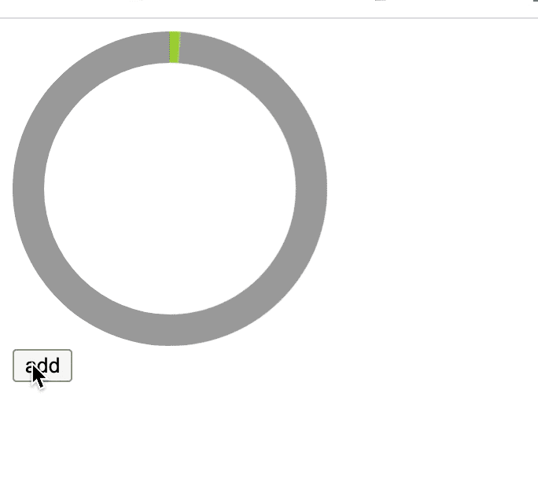
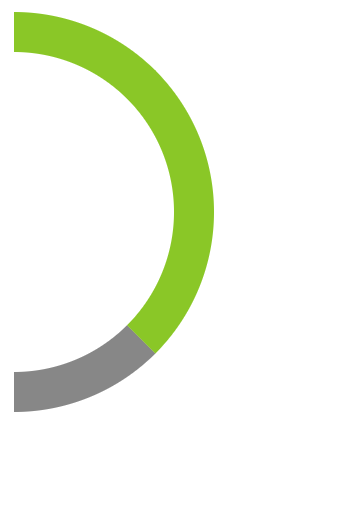
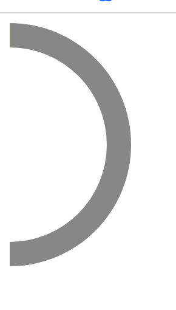
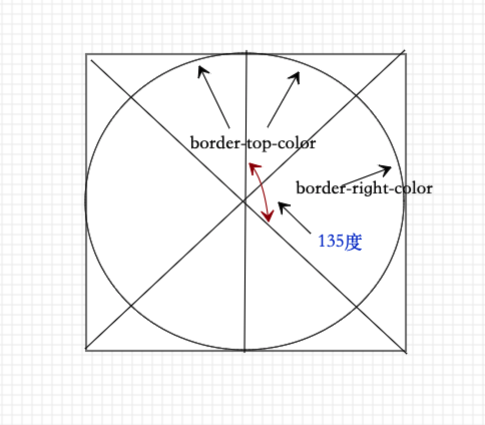
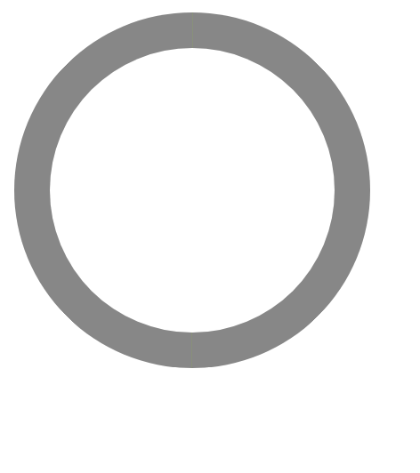
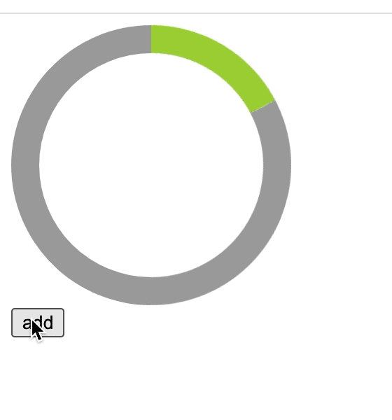
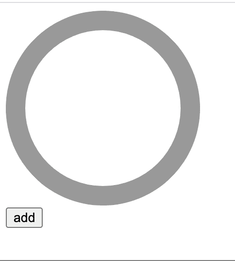

### css3 实现圆形进度条

实现圆环进度条可以有多种方式，之前使用了[svg的方式](../svgCircle/readme.md)实现，这里使用css3来实现一下圆形进度条

首先看一下最终的实现效果：



它的原理还比较简单，就是通过控制两个半圆的旋转角度来实现。

首先我们来画一个带border的半圆：

```html
<style>
  .outer {
    display: flex;
  }
  .right {
    position: relative;
    width : 100px;
    height : 200px;
    overflow: hidden;
  }
  .rightcircle {
    position: absolute;
    top: 0;
    right: 0;
    width: 160px;
    height: 160px;
    border: 20px solid #999;
    border-radius: 50%;
    border-top-color: yellowgreen;
    border-right-color: yellowgreen;
    /* transform: rotate(-135deg); */
    transition: transform .5s;
  }
</style>
<body>
  <div class="outer">
    <div class="right">
      <div class="rightcircle"></div>
    </div>
  </div>
</body>
```

其中right元素是一个宽100，高200的盒子，这个控制只显示圆的一半

rightcircle元素是宽高各160、border为20的元素，这个元素用来做圆的形状

设置了rightcircle元素的border-top-color和border-right-color的颜色，它的一半是有颜色，一半是灰色的，效果如下：



但是发现，它的有背景的边框是显示出来的，需要给它加上旋转属性，让它隐藏起来：

```css
transform: rotate(-135deg);
```



为什么要旋转135度？画一个图辅助理解：



好了，现在右边的圆已经设置好了，同样的，再添加左边的圆就比较容易了：

```html
<style>
  .outer {
    display: flex;
  }

  .left {
    position: relative;
    width : 100px;
    height : 200px;
    overflow: hidden;
  }
  .leftcircle {
    position: absolute;
    top: 0;
    left: 0;
    width: 160px;
    height: 160px;
    border: 20px solid #999;
    border-radius: 50%;
    border-bottom-color: yellowgreen;
    border-left-color: yellowgreen;
    transform: rotate(-135deg);

    transition: transform .5s;
  }

  .right {
    position: relative;
    width : 100px;
    height : 200px;
    overflow: hidden;
  }
  .rightcircle {
    position: absolute;
    top: 0;
    right: 0;
    width: 160px;
    height: 160px;
    border: 20px solid #999;
    border-radius: 50%;
    border-top-color: yellowgreen;
    border-right-color: yellowgreen;
    transform: rotate(-135deg);

    transition: transform .5s;
  }
</style>
<body>
  <div class="outer">
    <div class="left">
      <div class="leftcircle"></div>
    </div>
    <div class="right">
      <div class="rightcircle"></div>
    </div>
  </div>
  <div>
    <button onclick="add()">add</button>
  </div>
</body>
```

效果图如下：



再通过修改这两只圆的rotate的值，来控制旋转：

- 当旋转的角度小于180，只需要右边的圆旋转对应的角度
- 当角度在180和360之间时，右边的圆固定旋转45度，左边的圆再旋转对应的角度
- 大于360度，左边的圆和右边的圆固定旋转45度

顺着这个思路，我们来实现一下：

```js
let angle = 10
let left = document.getElementsByClassName('leftcircle')[0]
let right = document.getElementsByClassName('rightcircle')[0]

function start(){
  if(angle <= 180){
  // 右转左不转
    right.style.cssText = `transform: rotate(${-135 + angle}deg)`
  }else if(angle <= 360) {
    // 右转且左转
    right.style.cssText = `transform: rotate(${-135 + 180}deg)`
    left.style.cssText = `transform: rotate(${-135 + angle - 180}deg)`
  } else {
    right.style.cssText = `transform: rotate(${-135 + 180}deg)`
    left.style.cssText = `transform: rotate(${-135 + 180}deg)`
  }
}

// 点击按钮，调用这个方法
function add() {
  angle += 22
  start()
}
```

点击后的效果如下：



#### 版本二

功能基本能实现，但是还有个问题，在两个圆的衔接处存在一个断层的问题，为什么呢？

由于当把rotate的只值改变后，需要有500毫秒的动画时间，如果在这500毫秒内，再次触发了start方法，此时左边的圆开始做动画了。出现的现象就是，右边的圆动画还未做完，左边的圆就开始了动画过程。

解决方案是：
- 判断当前的旋转角度，当角度大于180的那个瞬间，只让右边的半圆旋转45度，刚好全出现，左边的先不动
- 当右边的旋转完毕后，再旋转左边的半圆

此时，修改start如下：

```js
function start(){
  let gap = 0
  if(angle > 180){
    // 这里的gap就是每次累加的值
    gap = angle - lastAngle
  }
  if(angle <= 180){
  // 右转左不转
    right.style.cssText = `transform: rotate(${-135 + angle}deg)`
  }else if(angle <= 180 + gap) {
    // 这里只会执行一次，设定的条件是 当前角度小于 180 + gap
    right.style.cssText = `transform: rotate(${-135 + 180}deg)`
  }else if(angle <= 360) {
    // 右转且左转
    right.style.cssText = `transform: rotate(${-135 + 180}deg)`
    left.style.cssText = `transform: rotate(${-135 + angle - 180}deg)`
  } else {
    right.style.cssText = `transform: rotate(${-135 + 180}deg)`
    left.style.cssText = `transform: rotate(${-135 + 180}deg)`
  }
  lastAngle = angle
}
```

#### 版本三

测试发现，当我们快速点击的时候，还是会出现一点点的断层现象。所以我们需要控制start函数的触发频率，引入一个节流函数来控制start函数的控制频率，它的触发频率需要在当前的动画做完之后。

```js
  function throttle(fn, delay = 1000){
    let timer = null
    let lastTime = Date.now()
    return function () {
      let nowTime = Date.now()
      // 触发间隔是否小于 200 
      let sp = nowTime - lastTime < delay
      if( sp ) {
          return
      }
      lastTime = nowTime
      // 这样可以保证在最后一次被触发
      timer = setTimeout(() => {
        console.log('timer')
        fn()
        clearTimeout(timer)
        timer = null
      }, 10)
    }
  }

  var newStart = throttle(start, 400)

  // 用这个方法来测试一下
  function walk(){
    setTimeout(() => {
      angle = 100
      newStart()
    }, 1000);
    setTimeout(() => {
      angle = 200
      newStart()
    }, 2000);
    setTimeout(() => {
      angle = 300
      newStart()
    }, 3000);
    setTimeout(() => {
      angle = 400
      newStart()
    }, 4000);
  }
  walk()
```

看一下最后的效果：



### 总结

通过上面的实践，我们可以解决了衔接处的断层问题，但是也出现了一个明显的视觉上的问题，就是不论每次增加多少的角度，都会在180度的时候有个停顿。如果有了更好的方案再看如何来解决这个问题。