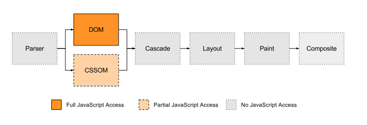
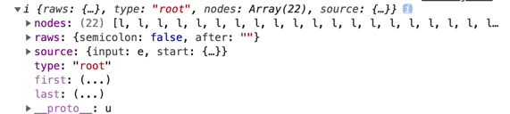
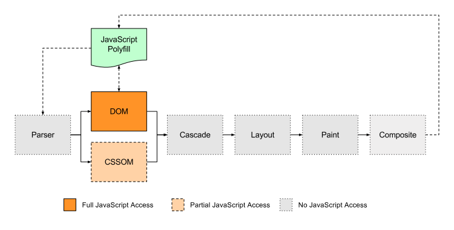
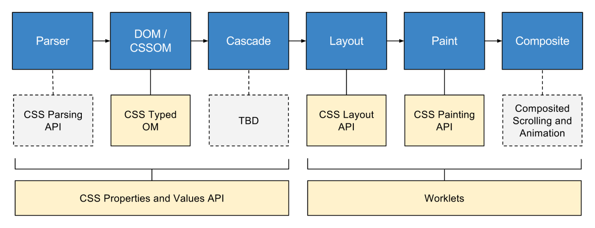

# css houdini

## 前言

开始听到houdini这个名称，就是刚听到react这个东西，一顿懵逼，不知是何方大神。经过一番了解后，也才发现它只不过是为我们换了一种css的写法，只是相对以前给我们提供了更多的选择，有种手脚被放开了的感觉，至于要怎么玩，各位开发者去自行发挥你们的想象力。下面让我们来一层层解开houdini的神秘的面纱！！

下面，我们可以带着几个问题来一步步了解它，并在文章后面会逐个回答这些问题

1、它是什么？<br>
2、我们为什么要用它<br>
3、它能做什么？<br>

## 现状

在介绍之前，我们先看一个问题，页面有个div盒子，css中这么写，想实现一个随机值的宽度：

```css
.app {
  height: 200px;
  width: calc(random * 100%);
}
```
目的很明确，想把上面的css转成这样：
```css
.app {
  height: 200px;
  width: calc(0.3456 * 100%);
}
```

我们似乎束手无策，除非浏览器给我们提供了这么一个东西，或者使用css预处理语言的比如sass、scss等(这些我们暂不考虑)

我们采用转换css`(css polyfill)`的方式，既然官方不支持，我们就动手实现一个`民间版的random`，因为js polyfill不就是那么做的吗

但是js polyfill是基于js语言的动态特性，用js给js打上补丁这是很容易实现的，但是**css没有运行时状态**啊，那我如何给它打补丁呢？

要解决这个，我们先简单熟悉下浏览器的整个渲染流程。

## 浏览器的渲染过程

我们知道，浏览器在渲染页面时，首先会解析页面的 HTML 和 CSS，生成渲染树（rendering tree），再经由布局（layout）和绘制（painting），呈现出整个页面内容。



作为开发者，这个流程上我们能操作的空间少之甚少，我们无法控制浏览器解析html和css的过程，以及之后的layout 和 painting 环节，开发可以参与这整个的过程只能是生成 DOM 和 CSSOM 的过程了

## 实现polyfill

### cssom

基于此，眼前一片明朗，我们可以对CSSOM下手了，在生成了cssom后，我们找到其中的random这个东西，再把它神不知鬼不觉的替换成一个随机值就完事了。看看怎么做。
通过浏览器提供的 documnet.styleSheets 访问 cssom：

```js
function accessCssom () {
  for (const stylesheet of document.styleSheets) {
    // 展开嵌套的规则（如@media块）到一个单独的数组
    const rules = [...stylesheet.rules].reduce((prev, next) => {
      return prev.concat(next.cssRules ? [...next.cssRules] : [next]);
    }, []);
    // 遍历每个展开的规则，并且替换random为一个随机数字
    for (const rule of rules) {
      for (const property of Object.keys(rule.style)) {
        const value = rule.style[property];
        console.log(value, 99999)
        if (value.includes('random')) {
          rule.style[property] = value.replace('random', Math.random());
        }
      }
    }
  }
}
```
这个做法看似无懈可击，但是不幸的是，我们并没有在其中找到random的踪迹，所以刷新页面并没有想要的效果，原因是，**浏览器捧到不认识的css属性会直接忽略掉**。。。。:(，导致我们这次修改css的尝试失败。

### 修改原生css

那既然cssom不提供给我们期望的东西，我们就直接从源头上尝试，直接获取原始的css样式文件，找到random修改它，这样总可以吧！！:smile:

这个方案中，我们的思路是，遍历DOM树，找到其中的`<style>` 和 `<link rel="stylesheet">` 标签，***获取其中的 CSS 样式、解析、重写，最后再加回 DOM 树中***。

#### 获取页面css样式

```js
const getPageStyles = () => {
  var styleElements =
      [...document.querySelectorAll('style, link[rel="stylesheet"]')];

  // 对于外链样式使用fetch请求获取，内部样式获取标签内容
  return Promise.all(styleElements.map((el) => {
    if (el.href) {
      return fetch(el.href).then((response) => response.text());
    } else {
      return el.innerHTML;
    }
  })).then((stylesArray) => {
    return stylesArray.join('\n')
  });
}
getPageStyles()
```
获取到的其中部分内容如下，
```css
.app {
  height: 200px;
  width: calc(random * 100%);
}
```
我们顺利拿到了想要的内容，接下来就是解析这些css样式文本

#### 解析css样式

如何解析呢？浏览器并没有提供解析的api，当然我们可以写一个js方法替换字符串的方式，但是那样并不严谨，要兼顾到的问题还听到，其他地方也可能使用到random关键字，比如url、content。幸好还有[postCss](https://postcss.org/)，postCss会把css解析成**AST**，类似自定义版本的**CSSOM**

执行
```js
getPageStyles()
  .then((css) => postcss.parse(css))
  .then((ast) => console.log(ast));
```
👆上面的css解析成这样：

```js
{
  type: 'root',
  nodes: [
    {
      type: 'rule',
      selector: ".app",
      nodes: [
        {
          type: "decl",
          prop: "width",
          value: "calc(random * 100%)"
        },
      ]
    },
  ]
}
```
打开[项目示例](https://minjiechang.github.io/react-css-houdini/#/)，你可以看到完整的解析结果。



#### 修改ast

使用postCss解析css文本后，拿到解析的AST，现在使用postCss插件实现一个polyfill

实现一个postCss插件，修改ast：

```js
const randomKeywordPlugin = postcss.plugin('random-keyword', () => {
  return (css) => {
    css.walkRules((rule) => {
      rule.walkDecls((decl, i) => {
        if (decl.value.includes('random')) {
          decl.value = decl.value.replace('random', Math.random());
        }
      });
    });
  };
});
```
将以上代码组织起来：
```js
getPageStyles()
.then((css) => postcss([randomKeywordPlugin]).process(css)
.then((result) => {
  // result.css 就是替换后的css文本
  console.log(result.css, 'result');
}))
```

#### 替换css文本

上面的过程通过ast的修改再转换，我们得到了新的css文本，现在只需要将这个新的css文本插入到style标签中，并删除原有的style标签即可实现替换

添加style标签，并删除原标签
```js
const replacePageStyles = (css) => {
  const existingStyles =
      [...document.querySelectorAll('style, link[rel="stylesheet"]')];

  const polyfillStyles = document.createElement('style');
  polyfillStyles.innerHTML = css;
  document.head.appendChild(polyfillStyles);

  existingStyles.forEach((el) => el.parentElement.removeChild(el));
};
```

将以上代码组织起来：

```js
getPageStyles()
.then((css) => postcss([randomKeywordPlugin]).process(css)
.then((result) => {
  // result.css 就是替换后的css文本
  replacePageStyles(result.css)
}))
```

到此为止，我们终于大功告成实现了一个自定义的css polyfill。

再回过头看一下，为实现这个`random` 的 `polyfill`所做的工作：

- 遍历dom树，获取style标签的样式及外链样式
- 解析css 文本为ast
- 通过ast修改random关键字
- 把ast转为css文本，并替代旧的样式

为了实现这么一个自定义的的css样式，我们绕了一大圈，虽然看起来是达到了目的，但其实这种方式还存在诸多问题没有解决：

**待解决的问题**

1、对于内联样式、隐藏元素无法覆盖到，本例只列举了style标签及link<br>
2、未考虑css选择器优先级规则(比如important)，这会增加parser复杂度

**不可避免的问题**

1、复杂度，为了兼容一个属性，需要大量的额外代码支持<br>
2、性能，每次执行polyfill都是粗暴的删除、插入样式，引起页面重绘，对于会频繁触发的操作(比如页面滚动、缩放等)需要频繁触发上面的过程，对页面性能是很大的影响<br>
3、不稳定，随着复杂度增加，导致错误增加<br>

对于重置css引起的性能问题可以用这个图表示：


可以看出，Javascript在DOM构建之后不能干涉原始的渲染流程，这就意味着我们的补丁造成的任何改变都需要整个渲染过程重新开始。

### 总结一下

在上面我们试着想实现一个浏览器并不支持的css样式，最终我们发现那并不容易，即使可以实现了也依然存在很大的问题。实现一个民间版本的是如此艰难，我们期望浏览器能不能提供这样一个功能或者api让我们愉快的玩耍？

答案就是**houdini**！！

## houdini 是什么

houdini 是 W3C 新成立的一个任务小组，它的终极目标是实现 css 属性的完全兼容。Houdini 提出了一个前无古人的的设想：开放 CSS 的 API 给开发者，开发者可以通过这套接口自行扩展 CSS，并提供相应的工具允许开发者介入浏览器渲染引擎的样式和布局流程中。它的提出要解决的问题就是

- 跨浏览器兼容问题<br>
- css polyfill 实现困难的问题

其实早在2016年，houdini的概念就已经出现了，只是到2018年chrome65发布的时候才支持这一新特性，可以说它的出现是css领域的一大革新，网上有文章说这是css领域近来几年最振奋人心的革新。

引入官方的介绍
> Houdini 是 W3C 新成立的一个任务小组，它的终极目标是实现 css 属性的完全兼容。Houdini 提出了一个前无古人的的设想：开放 CSS 的 API 给开发者，开发者可以通过这套接口自行扩展 CSS，并提供相应的工具允许开发者介入浏览器渲染引擎的样式和布局流程中。

从上面的介绍中，Houdini要做的是提供一套api，让开发者可自行拓展css，给予开发者更多的权限。

## houdini目前进展

前面我们提到，在浏览器的渲染过程中，开发者很难干涉到整个渲染过程，除了DOM和CSSOM，houdini组织为了解决这个问题提出了一些新的标准，给予开发者更多权限介入另外几个渲染环节，下面这张图片展示的是每个环节对应的新标准，开发者可以用这些标准来控制对应的环节



其中灰色部分还在实现中，目前不能使用，下面我们先介绍几个可用的api，后续有其他api有更新了再补充

### CSS Properties and Values API

自定义属性值api，它提供了registerProperty方法，允许我们在css中使用自定义的属性，我们看看使用这个api实现一个**houdini版的random**属性

问，把大象塞入冰箱需要几步？

第一步：定义一个自定义属性<br>
```js
function registerProperty(){
  window.CSS.registerProperty({
    name: '--my-len',
    syntax: '<number>',
    inherits: false,
    initialValue: Math.random(),
  });
}
registerProperty()
```
> 注，为了避免和上面的random冲突，这里使用 --my-len 来表示随机数属性

第二步：使用这个自定义属性<br>
```css
.home {
  height: 200px;
  width: calc(var(--my-len) * 100%);
}
.home:hover {
  --my-len: 0.65;
}
```
你会发现，就是这么的简单，只需两步，没有上面的那些复杂的过程。

同样，还可以使用js控制自定义样式
```js
function setProp(value) {
  document.querySelector('.home').style.setProperty('--my-len', value);
}
export default function(){
  return <div>
    <span onClick={() => setProp(Math.random())}>click me</span>
  </div>
}
```
> 需要注意几个小细节<br>
1、name：自定义属性名，需要以双横线--开头<br>
2、syntax：语法，表示属性值的类型，具体的值可[参考这里](https://drafts.css-houdini.org/css-properties-values-api/)<br>
3、inherits：继承性，自定属性值是否可被子元素继承<br>
4、initialValue：初始值

打开[项目示例](https://minjiechang.github.io/react-css-houdini/#/useHoudini)查看

总结一下，使用自定义属性值api，可以带来这几点便利性：

1、使用自定义属性，动态控制某个css属性值，这对于实现动画效果非常便利，而现在的技术我们似乎办不到<br>
2、也可使用js控制自定义属性<br>
3、解决一些属性的兼容性问题

### CSS Painting API

这个api提供一个registerPaint方法，使用这个函数，可以注册一个自定义的绘制方法名，在css中使用的使用调用paint()方法，传入自定义的名称即可，在CSS属性如 background-image, border-image, mask-image, 可使用paint函数

和自定义属性中api不同的是，这个api的注册使用需要有三个步骤：

1、定义一个worklet

```js
function registerWorklet() {
  if ("paintWorklet" in CSS) {
    // 可使用本地文件地址，也可使用线上文件
    CSS.paintWorklet.addModule(`${process.env.PUBLIC_URL}/paintWorklet/headerHighlight.js`);
  }
}
registerWorklet()
```

2、使用registerPaint注册worklet

```js
registerPaint('headerHighlight', class {

  // 设置画布的透明度
  static get contextOptions() { return {alpha: true}; }

  // 获取元素自身属性值
  static get inputProperties() { 
    return [ '--checkerboard-spacing', '--checkerboard-size' ] 
  }
  // 此API暂时还不支持
  static get inputArguments() { return ['*', '<length>']; }
  /**
   * 
   * @param {Object} ctx 一个canvas对象
   * @param {Object} size {width, height}
   * @param {Map} properties 获取 inputProperties 返回的值
   * @param {Array} args 获取 inputArguments 返回值
   */
  paint(ctx, size, properties, args) {
	  ctx.fillStyle = 'hsla(55, 90%, 60%)';
    ctx.fillRect(0, 15, 200, 20);
    // ctx.fillRect( 0, size.height / 3, size.width * 0.4, size.height * 0.6 );
  }
});
```
函数第一个参数是自定义名称，第二个参数是一个类，在定义类中有几个固定方法：
- static get contextOptions：registerPaint基于canvas，这个方法设置画布的透明度，默认返回true<br>
- static get inputProperties：这个方法返回元素自身的属性，供canvas对象使用<br>
- static get inputArguments：调用paint()方法可以传入参数，这个方法就是返回传入的参数的类型，但是这个方法目前在chrome还不支持<br>
- paint 绘制函数，接收四个参数，第一个是canvas对象，后面三个参数接收上面三个函数返回的结果，有了自定义参数，可以给canvas的绘制带来极大的灵活度

3、在css中调用paint方法
```css
.fancy {
  --checkerboard-spacing: 10;
  --checkerboard-size: 20;
  background-image: paint(headerHighlight);
}
```
打开[项目示例](https://minjiechang.github.io/react-css-houdini/#/paint)，查看在react中使用

### Worklet

需要注意的是，这里有个[worklet](https://drafts.css-houdini.org/worklets/)的概念

Worklets 的概念和 web worker 类似，它们允许你引入脚本文件并执行特定的 JS 代码，这样的 JS 代码要满足两个条件：第一，可以在渲染流程中调用；第二，和主线程独立。

Worklet 脚本严格控制了开发者所能执行的操作类型，这就保证了性能。

所以注册paint方法需要放到独立的js文件中，让浏览器的Worklet加载执行。

那既然Worklets和web worker类似，那为什么不直接使用web worker呢？

因为 Houdini 是希望将开发者的程式码 hook 到 CSS engine 中运作，而根据规范內的叙述，web worker 相对笨重，不适合用来处理 CSS engine 這种可能会牵扯到数百万像素图片的工作。

所以可以推断，Worklets 的特点就是轻量以及生命周期较短。

延伸：[Web worker，service worker和worklet](https://www.javascriptcn.com/read-52409.html)

### CSS Layout API


## 总结

### 优点

### 问题

### 参考文档

[w3c](https://www.w3.org/TR/css-properties-values-api-1/)
[MDN](https://developer.mozilla.org/en-US/docs/Web/Houdini)