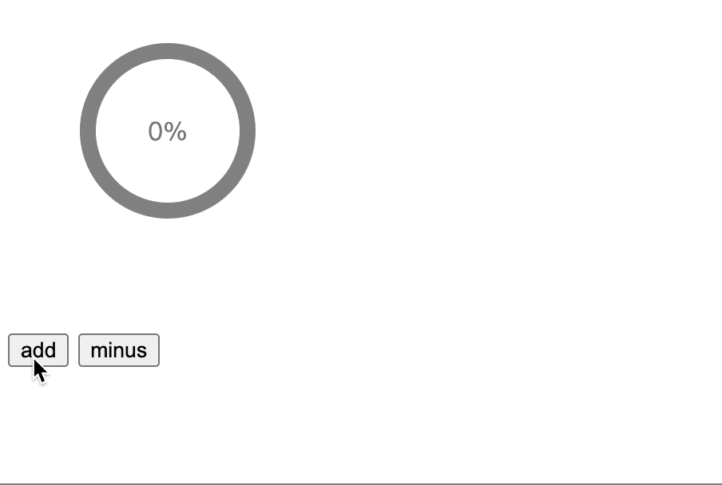
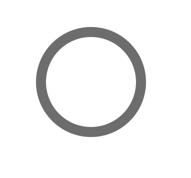
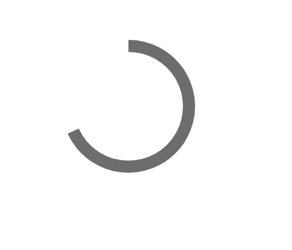

### svg 实现圆形进度条

最近在做海报生成的过程中，需要使用圆形的进度条来表示加载的进度，经过一番查找资料，发现实现这个效果主要有两种方式，

- 一种是使用传统的 html + css 的方法
- 一种是使用svg的方式，这种方式比较清奇，同时实现起来也是比较简单

这里，我们就来介绍下使用svg的方式。先看一下最终效果图：



### 实现

下面我们就一步步使用svg来实现这个效果。

首先使用circle元素画一个圆

```js
<svg width="200" height="200" viewBox="0 0 200 200">
  <circle id="circleBg" cx="100" cy="80" r="50"  fill="none" stroke-width="10" stroke="gray" />
</svg>
```
解析下这两个元素的各自属性：

svg：
- width，height，分别表示svg元素的宽高
- viewBox：
  - 前两个参数是对svg元素做位移使用，通常设置为0；
  - 后两个参数表示svg元素可容纳的大小，具体可参考[svg 属性之 viewBox](https://segmentfault.com/a/1190000009226427?utm_source=tag-newest)

circle:
- cx、cy：圆心的位置
- r：表示半径
- fill: circle 圆的填充色
- stroke-width：边框宽度
- stroke：边框的填充色

效果图如下：


现在已经实现了一个有边框的圆了，下面要完成的是让边框可以动起来，这个就不得不提到两个新的属性：

- stroke-dasharray：顾名思义，dash表示虚线，stroke-dash可理解为将边框设置为虚线，stroke-dasharray表示这个属性可以接收多个值，实际上一般是接收两个值，例如：
  - stroke-dasharray: 2,2，表示边框的长度是200，间隔200的宽度，再有200的虚线长度...，依次类推，呈现的效果是 --  --  --  --

- stroke-dashoffset：设置边框的偏移距离，这个属性是核心，通过设置它的偏移位置来模拟出百分比

```css
#circle {
  stroke-dasharray: 314, 314;
  stroke-dashoffset: 100;
}
```

其中，314是圆的周长，也就是边框的长度，我们把边框偏移100，也就是往左边隐藏100，得到的效果如下：

[3](./images/3.png)

但此时有个问题，边框偏移的位置是从右侧中间开始的，我们期望从上方开始计算偏移，这需要使用transform属性：

```js
<circle id="circle" transform="rotate(-90, 100, 80)" />
```

这个属性还比较特殊，它不能写在css中，只能写在标签上，可接收三个值：

- 第一个表示旋转角度
- 第二、第三个值表示旋转的圆点，一般设置为圆心的位置。不设置的化默认是svg左上角的点

旋转后效果如下：



接下来的事情就简单了，我们只需要动态的设置stroke-dashoffset属性的值就可以了，区间从0-314即可。

此外，再在svg中添加text标签，显示当前的比例值：

```js
<!DOCTYPE html>
<html>
	<style>
	#circle{
	 transition: all .5s;
	 stroke-dasharray: 314,314;
	 stroke-dashoffset: 314;
	}
	
	svg:hover #circle{
		stroke-dashoffset: 0;
	}
	</style>
<body>

<svg width="200" height="200" viewBox="0 0 200 200">
  <circle id="circleBg" transform="rotate(-90 100 80)" cx="100" cy="80" r="50"  fill="none" stroke-width="10" stroke="gray" />
  <circle id="circle" stroke-linecap="round" transform="rotate(-90 100 80)" cx="100" cy="80" r="50"  fill="none" stroke-width="10" stroke="green" />
  <text x="100" y="80" fill="#6b778c" text-anchor="middle" dominant-baseline="central">
    <tspan id="percent">0</tspan>%
  </text>
</svg>
<div>
  <button onclick="add()">add</button>
  <button onclick="minus()">minus</button>
</div>
</body>
<script>

  let circle = document.getElementById('circle')
  let percent = document.getElementById('percent')

  let init = 314
  let v = init

  function getPercent(num) {
    let percent = Math.round(((init - num) / init) * 100)
    console.log(percent, 'percent')
    return percent
  }

  function add(){
    v = v - 20
    if(v <= 0 ) {
      v = 0
    }
    percent.innerHTML = getPercent(v)
    circle.style['stroke-dashoffset'] = v
  }
  function minus(){
    v = v + 20
    if(v >= 314 ) {
      v = 314
    }
    percent.innerHTML = getPercent(v)
    circle.style['stroke-dashoffset'] = v
  }
</script>
</html>
```

新添加了一个属性，stroke-linecap，设置为 round，显示为圆角，默认为butt

最后，还需要添加一个背景底色，可以再画一个圆来填充底色：

```js
<svg width="200" height="200" viewBox="0 0 200 200">
  <circle id="circleBg" transform="rotate(-90 100 80)" cx="100" cy="80" r="50"  fill="none" stroke-width="10" stroke="gray" />
  <circle id="circle"></circle>
</svg>
```

完整代码[看这里](https://github.com/MinjieChang/circle-process/blob/master/src/c3Circle.html)

### 总结

通过用svg实现进度条后，可发现核心的地方就在于两个属性，有了这个基本的认识后，再用react或vue实现也就比较容易了。

[react-circle](https://github.com/zzarcon/react-circle)