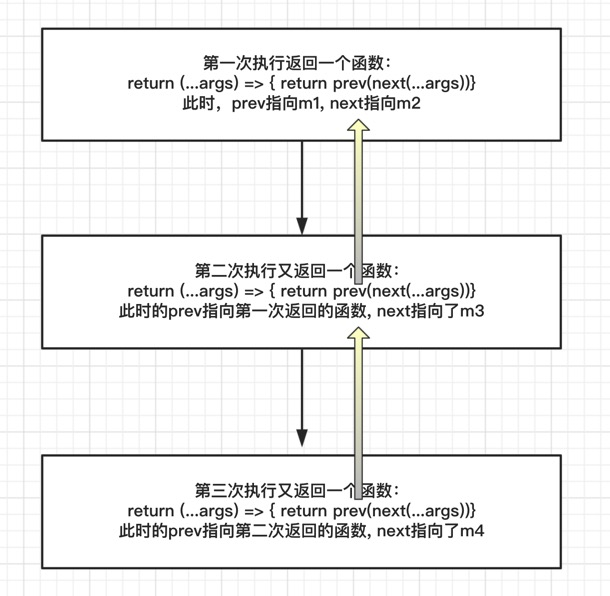

### AOP模式

##### aop 是什么

aop又叫面向切面编程，主要作用是把一些和跟核心业务逻辑无关的功能包括日志统计、打点上报、异常处理等。把这些功能抽离出来后，再通过==动态织入==的方式掺入业务逻辑模块中。aop在js中是个被严重忽略的技术点。

##### aop有什么优势
aop的好处首先是可以保持我们业务逻辑模块的纯净和高内聚性，其次，可以很方便的复用日志统计等功能模块

##### 从一个例子开始
我们发现一段代码执行比较耗时，现在我们想知道，这段代码执行了多次时间。通常做法是，在执行开始阶段记录一下当前时间，在执行结束阶段用当前时间减去开始执行的时间：

```js
function test() {
  let start = new Date().getTime()
  for (let index = 0; index < 100; index++) {
    let div = document.createElement('div')
    document.body.appendChild(div)
  }
  let end = new Date().getTime()
  console.log(end - start)
}
```
这样的确可以解决问题，但是有个问题是，我们要打入到函数内部，去修改‘源码’，这样就对原函数的侵入性很强了，如果后面需要再函数执行前再插入某个功能，需要再对这个函数进行改动。其他逻辑和业务逻辑夹杂在一起，后面越来越难以维护。

现在我们用aop的方式加以改进，把其他功能动态织入到业务功能中，而不用修改原来的业务逻辑。js实现aop的方式有多种。我们使用Function.prototype拓展的方式来实现，先看两个函数：

```js
Function.prototype.before = function (beforeFn) {
  let self = this // 保存对原函数的引用
  return function () { // 返回包含原函数和参数函数的‘代理函数’
    // 先执行 beforeFn
    beforeFn.apply(this, arguments)
    // 再执行原函数
    return self.apply(this, arguments)
  }
}

Function.prototype.after = function (afterFn) {
  let self = this // 保存对原函数的引用
  return function () {
    // 先执行原函数
    let ret = self.apply(this, arguments)
    // 再执行 afterFn
    afterFn.apply(this, arguments)
    return ret
  }
}
```
现在用这两个函数改造上面的记录时间：

```js
function count () {
  console.log('count')
  for (let index = 0; index < 100000000; index++) {
  }
}

const logTime = function (fn) {
  let start
  return fn.before(function () {
    start = new Date().getTime()
    console.log(...arguments, 'before') // 111 222
  }).after(function () {
    console.log(new Date().getTime() - start)
    console.log(...arguments, 'after') // 111 222
  })
}
logTime(count)(111, 222)
```
控制台会依次输出：111 222 before，‘count’, 111 222 after  
看见没有，通过我们改造后的logTime函数， 现在我们可以使用这个函数，来给任何函数添加记录执行时间，实现了该函数复用的同时，不会侵入原函数内部。


##### 常用场景

> 分离表单请求和校验  

我们在提交表单请求之前，一般会先验证一下表单参数是否合规，类似这样: 
```js
function validate (value) {
  if (!value.length) {
    return false
  }
  if (value.length > 10) {
    return false
  }
  return true
}

function submit (value) {
  if (!validate(value)) return
  // 提交请求
  form.submit(value)
}
submit(formValue)
```
这样把验证函数validate耦合在了submit一个函数内，导致submit不够纯洁了，我们用aop的方法来加以改造：

```js
// 定义提交函数
let submit = function (value) {
  form.submit(value)
}
// 添加before 切面函数
submit = submit.before(validate)
submit(value)
```
是不是现在submit函数变的非常干净了，改造后的submit函数遵循了单一职责的原则

当然此时我们需要改造一下我们的before函数，当validate函数返回false的时候，submit函数就不再执行了

```js
// 改造before函数
Function.prototype.before = function (beforeFn) {
  let self = this // 保存对原函数的引用
  return function () { // 返回包含原函数和参数函数的‘代理函数’
    // 先执行 beforeFn
    let ret = beforeFn.apply(this, arguments)
    // 当beforeFn返回false不再往下走了
    if(!ret) {
        return ret
    }
    // 再执行原函数
    return self.apply(this, arguments)
  }
}

// 改造after函数
Function.prototype.after = function (afterFn) {
  let self = this // 保存对原函数的引用
  return function () {
    // 先执行原函数
    let ret = self.apply(this, arguments)
    if(ret){
        return ret
    }
    // 再执行 afterFn
    return afterFn.apply(this, arguments)
  }
}
```
通过观察我们发现，原函数和beforeFn其实是共用了this 和 arguments，此时this指向的是全局(window, 关于this下面再讲)
所以value参数也能顺利的传递到validata函数里.

还有一个额外的问题是，validate函数内部有太多的if else 判断，我们可以使用策略模式来加以改造：
```js
const validate_rules = {
  not_empty () {
    let val = [].shift.call(arguments)
    return val.length > 0
  },
  max_length () {
    let args = [].slice.call(arguments)
    let val = args[0]; let length = args[1]
    return val.length < length
  }
}
function validate () {
  for (let key in validate_rules) {
    if (!validate_rules[key].apply(this, arguments)) {
      return false
    }
  }
  return true
}
let submit = function (value) {
  // 提交
  form.submit(value)
}
// 添加before 切面函数
submit = submit.before(validate)
submit(formValue)
```
现在validate函数不用再修改，如果新增了验证规则，只需要在validate_rules中添加验证函数即可，真正实现了验证规则的可配置性


> 数据上报

在移动端项目中，经常有加埋点的需求，比如点击了某个按钮，需要加对应的埋点，通常我们会在原函数内加上埋点：
```js
{
  methods: {
    btnClick() {
      // 业务逻辑
      this.showDialog = true
      // 添加埋点
      this.$tracker({ elementCode: 104340 })
    }
  }
}
```
用aop来改造一下：
```js
{
  methods: {
    track () {
      // 添加埋点
      this.$tracker({ elementCode: 104340 })
    },
    showDialog () {
      // 业务逻辑
      this.showDialog = true
    },
    btnClick () {
      this.showDialog.after(this.track)()
    }
  }
}
```


> 职责链

通过观察Function.prototype.before和Function.prototype.after函数我们发现，通过控制beforeFn和afterFn的返回值(true 或 false)，我们可以控制函数是否继续往下执行，当返回一个==有效值时==阻断职责链的传递，而返回null或者false等时继续传递请求。这种方式对应需要进行流程控制的场景非常有效。

职责链条在js中典型的运用是冒泡机制，把父节点和所有的子节点练成一条链，并通过这条链传递事件，直到有一个节点能处理事件为止。职责链是消除过多if else 的神器

另一个典型的运用就是找钥匙，现在我们手里有多把钥匙，但是我们不知道哪把钥匙能打开锁，只能一个一个的尝试，直到找到为止。这种场景就可以使用职责链条模式

我们先看一下通常的做法：

```js
function findThatKey (lock) {
  switch (lock) {
    case 1:
      return '钥匙1'
    case 2:
      return '钥匙2'
    case 3:
      return '钥匙3'
    default:
      break
  }
}
```
使用aop加以改造：

```js
function Key1 (lock) {
  return lock === 1 ? '钥匙1' : false
}
function Key2 (lock) {
  return lock === 2 ? '钥匙2' : false
}
function Key3 (lock) {
  return lock === 3 ? '钥匙3' : false
}
let findKey = function () {
  return Key1.after(Key2).after(Key3)
}
let key = findKey()
console.log(key(3)) // 得到 '钥匙3'
```
上面把每把钥匙对应的锁抽成了一个一个的函数，这样做显而易见的好处是，把函数的实现和函数的使用分离开来  
假如我已经知道了钥匙3不是开这个锁的，那么可以这么做：

```js
let findKey = function () {
  return Key1.after(Key2)
}
```
或者新增了一把钥匙4，就可以这么做：

```js
function Key4 (lock) {
  return lock === 4 ? '钥匙4' : false
}
let findKey = function () {
  return Key1.after(Key2).after(Key4)
}
```
对比之前的使用switch case 的方式，代码看起来会更舒适一些

当然，对于这种找钥匙的一般场景，除了使用职责链模式，我们还可以使用==迭代器==模式来实现，具体可看另一篇文章

再看一个更实际的例子：  
现在有个文件上传的功能，提供了控件、html5、flash、表单上传这四种方式，根据它们的==优先级==和浏览器==支持情况==来决定使用哪种方式，使用aop改造前的伪代码如下：
```js
function getUploadObj(){
  if(support_plugin){
    return plugin
  }else if(support_html5){
    return html5
  }else if(support_flash){
    return flash
  }else{
    return form
  }
}
```
当然实际情况远不只此，还包括控件的初始化、容错处理等情况。有天我需要屏蔽掉flash，看起来是很简单的需求，但难度实际跟在心脏旁边拆掉一根毛线血管类似。尽管可以把内部的拆成方法提取出来，使代码看起来更简介，但是还是有这些if else多个条件的判断，让整个过程理解起来变得困难。

使用aop改造后：

```js
// 把每种控件的创建方式都包裹在各自的函数中, 确保没有逻辑交叉和相互污染
function get_plugin (){
  try {
    return new ActiveXObject()
  } catch (error) {
    return null
  }
}
function get_html5 (){}
function get_flash (){}
function get_form (){}
// 使用职责链条把他们链接起来
let uploadObj = get_plugin.after(get_html5).after(get_flash).after(get_form)()
```
需要注意的是，在每个控件创建方法中，约定如果可以正常获取上传对象就返回此对象，否则返回null，这样控制职责链函数继续向下执行。

> 动态修改参数

通过观察before函数我们发现，beforeFn和原函数其实是共用this 和 arguments的，意味着我们可以在beforeFn中修改arguments来达到动态修改参数的目的，这就是使用before来做前置装饰。

使用场景：  
使用ajax请求数据通常会设置一个默认的请求超时时长，但是对于有些接口比较慢的我们想把时长设置的长一些，此时我们就可以使用前置装饰来修改请求参数：

首先定义一个请求函数：  

```js
let fetchData = function(param){
  // console.log(param.timeout) 此时超时时长已经被动态装饰进来
  ajax(param)
}
```
这个函数里面没有逻辑处理和分支语句，它也不关心参数有什么内容，它只负责发送数据, 是一个单一职责的好函数.

接下来放置一个before装饰器
```js
fetchData = fetchData.before(function(param, time){
  param.timeOut = time
})
fetchData(param, 2000)
```
> 组合替代继承

js中子类通过继承的方式可以获取到父类的方法，子类在获取父类方法的基础上如果还有有自己个性的功能的话，可以使用改写父类的方法，如下，先定义一个Animal类, 和一个eat方法：
```js
class Animal {
  eat () {
    console.log('要吃饭')
  }
}
```
再定义一个Cat类继承Animal类，和eat方法：

```js
class Cat extends Animal {
  eat () {
    // 在此方法中先调用父类eat方法
    super.eat()
    console.log('要吃鱼')
  }
}
const cat = new Cat()
cat.eat() // 输出得到：要吃饭 要吃鱼
```
假如现在又来一个Dog类，同样需要和上面一样，继承Animal类，再重写eat方法，再实例一个dog对象，这样就比较繁琐，每次都要重新定义一个类，再实例一个对象。

我们可以使用后置装饰的方式来加以改造：
```js
class Animal {
  eat () {
    console.log('要吃饭')
  }
}
let instance = new Animal()
instance.eat = instance.eat.after(function () {
  console.log('要加肉')
})
instance.eat()
```
是不是一切都变的更加简洁了，都不需要额外定义一个类

##### 来个小总结吧

写到这里，aop要说的东西基本都说完了。有的同学可能就不同意了，你说了这么多aop好的方面，难道就没有缺点吗？是有的，比如它需要Function.prototype上面挂载before和after函数，有的同学就不太喜欢这样的方式。可以通过定义before 和 after 两个函数：
```js
function before (originFn, beforeFn) {
  return function () {
    let ret = beforeFn.apply(this, arguments)
    if (typeof ret === 'boolean' && !ret) {
      return ret
    }
    return originFn.apply(this, arguments)
  }
}

function after (originFn, afterFn) {
  return function () {
    let ret = originFn.apply(this, arguments)
    if (ret) {
      return ret
    }
    return afterFn.apply(this, arguments)
  }
}

let a = function () {
  console.log(2)
}
a = before(a, function () {
  console.log(this, 'this')
  console.log(1)
})
a() // 输出得到1 2
```
这种方式的缺点是，无法使用链式调用，除非多次使用before函数进行包装

##### 关于this
在before和after函数内部的this分别指向什么？

```js
let foo = function () {}
const logTime = function (fn) {
  return fn.before(function () {
    console.log(this, 'before')
  }).after(function () {
    console.log(this, 'after')
  })
}
foo = logTime(foo)
foo() 
// 打印为 window before 和 window after, 可见，before 和 after函数的this都是指向的全局
```
同样，通过如下方式：

```js
Function.prototype.before = function (beforeFn) {
  let self = this // 保存对原函数的引用
  return function before () { // 返回包含原函数和参数函数的‘代理函数’
    // 先执行 beforeFn
    console.log(this, 'before')
    beforeFn.apply(this, arguments)
    // 再执行原函数
    self.apply(this, arguments)
  }
}

Function.prototype.after = function (afterFn) {
  let self = this // 保存对原函数的引用
  return function after () {
    console.log(this, 'after')
    // 先执行原函数
    self.apply(this, arguments)
    // 再执行 afterFn
    afterFn.apply(this, arguments)
  }
}
```
打印得到的this也是window，
这是由于执行foo函数，foo指向window, 而foo函数是指向执行after函数返回的after代理函数，after内部的this指向window, 在after内部执行beforeFn.apply(this, arguments), 又把this（window）传给了beforeFn, 而beforeFn 是指向 执行Function.prototype.before返回的 before代理函数，所以bofore内部的this也是指向的window，所以this是从外界一层一层向内部传递的

通过以上分析，我们发现before切面函数返回的代理函数的this会发生改变，这也导致我们的beforeFn的this指向发生改变，如果不注意这点的话，会导致预料之外的结果，比如下面这样：

```js
var name = 'rose'
const obj = {
    name: 'jack',
    age: 18,
    getName(){
        console.log(this.name, 'getName')
    },
    console1(){
        console.log(1)
    },
    console2(){
        console.log(this, 'console2-this')
        console.log(this.name, 'console2')
    },
    console3(){
      console.log(this.age, 'console3')
    }
}
let myGetName = obj.getName.before(obj.console2)
myGetName()  // 打印得到的都是 rose
```
我预计输出的会是jack, 为什么输出的却是rose ?
这是由于，newGetName执行时其this指向window, 所以代理函数的this指向window，导致beforeFn.apply(this, arguments) 和 self.apply(this, arguments) 中的this 都是 window, 所以obj.getName() 和 obj.console2() 中的this也都指向了window, 打印得到的都是rose

那么这个问题怎么解决呢？很简单，调整newGetName的执行时候的this指向就完了：
```js
myGetName.call(obj)
```
或者这样：
```js
// 给obj.getName 重新赋值
obj.getName = obj.getName.before(obj.console2)
// 这样调用，getName的this就指向了obj
obj.getName()
```
##### 尝试用reduce重写职责链

```js
function compose (...fns) {
  return fns.reduce((prev, next) => {
    return function () {
      let ret = prev.apply(this, arguments)
      if (ret === false) return ret
      return next.apply(this, arguments)
    }
  })
}
let o = {
  a: 1,
  b: 2,
  c: 3
}
let f1 = function () {
  console.log(this.a)
}
let f2 = function () {
  console.log(this.b)
  return false
}
let f3 = function () {
  console.log(this.c)
}
let ret = compose(f1, f2, f3).call(o, 111111)
console.log(ret)
```
使用reduce函数，每迭代一次都会返回一个新的函数，然后该函数，这个代理函数在下次迭代中将再次被装饰

但是这个compose还有几个问题
- 它只支持前置装饰，对后置装饰无能为力
- 不够灵活，现在compose方法管的太多，以至于是否继续向下执行
这样的事情都由它来做了，我们想自己来接管这个过程。
- 目前只支持同步的装饰，无法支持异步的装饰


#### 使用高阶函数装饰
上面我们提到了当前的compose函数存在的问题，为了解决这个问题，我们需要把next方法抽离出来，为我们在适当的时机调用，从而决定要不要继续往下面的装饰函数执行

现在我们可以模仿redux的compose函数,使用高阶函数来对原函数加以装饰
```js
function compose (...fns) {
  if (fns.length === 1) {
    return fns[0]
  }
  return fns.reduce((prev, next) => {
    return (...args) => next(prev(...args))
  })
}
let o = {
  a: 1,
  b: 2,
  c: 3
}
let dis = (state) => {
  console.log(0)
  console.log(state, 'state')
}
let f1 = (next) => (state) => {
  next(state)
  console.log(1)
}
let f2 = (next) => (state) => {
  setTimeout(() => {
      next(state)
  })
  console.log(2)
}
let f3 = (next) => (state) => {
  next(state)
  console.log(3)
}
dis = compose(f1, f2, f3)(dis)
console.log(dis('state'))
```
这样做对好处有两点：

- 支持前后装饰
- next函数提到了外部，支持手动调用，调用者可以显示的控制链条是否继续向下传递，也解决了异步装饰的问题

#### 如何实现redux/compose函数


```js
// 定义初始函数
const dis = (action) => {
  console.log('dis')
  console.log(action)
}

// 再定义几个装饰函数
const m1 = (dis) => (action) => {
  console.log('m1')
  dis(action)
}

const m2 = (dis) => (action) => {
  console.log('m2 start')
  dis(action)
  console.log('m2 end')
}

const m3 = (dis) => (action) => {
  console.log('m3 start')
  dis(action)
  console.log('m3 end')
}
```

然后依次对dis函数进行装饰, 并执行装饰后的函数

```js
const newDis = m3(m2(m1(dis)))
newDis({name: 1111})
```

但是，我们发现打印的结果依次是
1. m3 start
1. m2 start
1. m1
1. dis
1. {name: 1111}
1. m2 end
1. m3 end

也就是，函数newDis是从m3开始执行的，这显然不是我们想要的，我们期望的是从m1开始执行

现在，调整我们的装饰过程：

```js
const newDis = m3(m2(m1(dis)))
newDis({name: 1111})
```
现在的结果是：
1. m1
1. m2 start
1. m3 start
1. dis
1. {age: 22222}
1. m3 end
1. m2 end

现在这个结果是我们期望的执行顺序。

基于以上思路，我们简单优化一下，使用一个函数装饰过程自动化：
```js
function compose(...middles){
  return function(dis){
    middles.reverse().forEach((mid) => {
      dis = mid(dis)
    })
    return dis
  }
}

const newDis = compose(m1, m2, m3)(dis)
newDis({})
```
这个函数其实就是，在compose内部依次执行了mid函数进行装饰

除了这种方式，我们还可以利用reduce方式，使用递归的方式来进行装饰，也就是redux的compose函数的实现方式


```js
function compose(...middles){
  return middles.reduce((prev, next) => {
    return (...args) => {
      return prev(next(...args))
    }
  })
}

```



这个其实是使用递归的思路实现：
- 每次执行都会返回一个新的函数，其中下一次返回的函数中的prev都指向上一次的返回的函数，意味着
- 第一次执行返回的函数叫f1, 其中prev为m1，next为m2
- 第二此返回的为f2, 其中prev指向了f1，next指向了m3
- 当f2执行的时候，传入action参数，首先m3先执行，将返回的结果传给了f1，
- f1执行中，先执行了m2，再将结果传给了m1
- 所以最终的执行顺序依然是m1(m2(m3(action)))

##### 最后的总结
使用aop确实可以对特定的代码加以改进，它可以显著的将代码逻辑进行拆分，有效的实现了逻辑的解耦，遵循函数的单一职责的原则。然后再利用aop动态织入的能力，把拆分的函数进行组合，实现特定功能的可插拔性

最后编辑于 2019.10.31

**Reference:**

[ 1 ] [aop js实现](https://www.cnblogs.com/zoucaitou/p/4179046.html)  
[ 2 ] [aop](https://www.cnblogs.com/zengyuanjun/p/7429968.html)