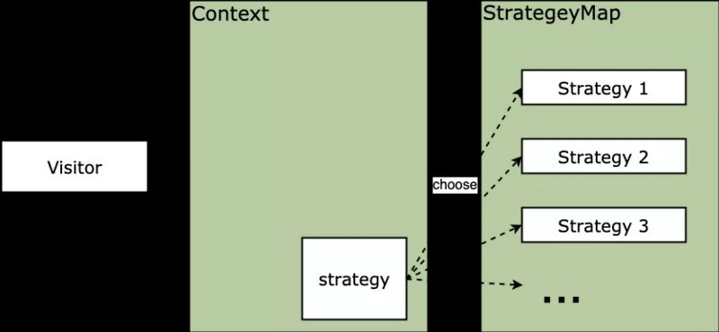

## 策略模式

### 背景

在平时开发过程中会碰到一些条件判断的场景，此时我们通常的做法是，会使用if else语句来描述：

```js
function getAge(name) {
  let age = 5;
  if (name === 'xiaoming') {
    age = 10
  } else if (name === 'xiaohong') {
    age = 15
  }
  return age
}
getAge('xiaohong')
```

这种写法没有什么问题，这样会带来的问题的就是，随着name的可能性增多，还需要再往这个函数中添加else语句，导致这个函数变得臃肿，增加维护难度。

下面我们可以使用一个改进的方式：

```js
const nameAge = {
  xiaoming: 10,
  xiaohong: 15
}
function getAge(name) {
  return nameAge[name] || 5
}
getAge('xiaohong')
```
上面的方式中，使用了一个**nameAge**对象来描述name和age之间的映射关系，然后在**getAge**方法中通过传入name来返回nameAge中对应的age，这么做的好处是，在后面新增了name，只需要在nameAge中添加即可，而getAge这个函数就不需要修改了，只需要维护nameAge这个对象即可。

以上的这个思想就可称之为一个简单的策略模式。

### 概念

策略模式(strategy pattern)又叫政策模式，其定义一系列的算法，把他们封装起来，并使他们可以相互替换。封装的策略算法一般是独立的，策略模式根据输入来调整使用哪个算法。关键是策略的**实现和使用分离**。

生活中，我们也能常见到策略模式的例子，比如螺丝刀和螺丝刀头拆分开来的情况：


在碰到不同型号的螺丝的时候，我们不需要更换一个螺丝刀，而只需要从工具箱中找出一个匹配的刀头安装上即可了。

再比如，汽车在不同的路况下会使用不同的轮胎，在雪地的时候可以更换使用雪地胎，在高速路上的时候可以使用扁平的高速胎，所以这样只需要更换轮胎即可。

在这些场景中，有如下共同点：

1. 螺丝刀头/轮胎（策略）之间是相互独立的，并且是可以相互替换的
2. 螺丝刀/汽车（封装上下文）可以根据需要选择不同的策略

### 案例解析

有这么一个场景，商家要举办一个活动，通过打折促销来销售库存物品，有的商品满100减30，有的商品满200减80，有的商品打8折，这样的逻辑交给我们，我们要怎样去实现呢。

```js
function priceCalculate(discountType, price) {	
  if (discountType === 'minus100_30') {
    // 满
    return price - Math.floor(price / 100) * 30
  }
  else if (discountType === 'minus200_80') {	
    return price - Math.floor(price / 200) * 80	
  }	
  else if (discountType === 'percent80') {
    return price * 0.8	
  }	
}	
priceCalculate('minus100_30', 270)    // 输出: 210	
priceCalculate('percent80', 250)      // 输出: 200
```

如在开头我们给出的例子那样，我们需要根据不同的条件给出不同的结果，随之带来的就是要写多个`if else`语句，关于这样的弊端就不再重复说了。

同样的，将计算折扣的算法部分提取出来保存为一个对象，折扣的类型作为 key，这样索引的时候通过对象的键值索引调用具体的算法，改造方式如下：

```js
const DiscountMap = {	
  minus100_30: function(price) {	
    return price - Math.floor(price / 100) * 30	
  },	
  minus200_80: function(price) {	
    return price - Math.floor(price / 200) * 80	
  },	
  percent80: function(price) {	
    return price * 0.8	
  }	
}	
/* 计算总售价*/	
function priceCalculate(discountType, price) {	
  return DiscountMap[discountType] &amp;&amp; DiscountMap[discountType](price)	
}	
priceCalculate('minus100_30', 270)	
priceCalculate('percent80', 250)	
// 输出: 210
// 输出: 200
```

同样的，要再添加一个策略也很容易了：

```js
DiscountMap.minus150_40 = function(price) {	
  return price - Math.floor(price / 150) * 40
}
```

此时有个问题是，我们把策略对象暴露在了外面，增加了它被任意的修改的危险，这违背了最小知识的原则。所以，更好的做法是，我们把把策略对象封装起来，只暴露给外界调用和添加的接口，实现如下：

```js
const PriceCalculate = (function () {
  /* 售价计算方式 */
  const DiscountMap = {
    minus100_30: function (price) {      // 满100减30	
      return price - Math.floor(price / 100) * 30
    },
    minus200_80: function (price) {      // 满200减80	
      return price - Math.floor(price / 200) * 80
    },
    percent80: function (price) {        // 8折	
      return price * 0.8
    }
  }
  return {
    priceClac: function (discountType, price) {
      return DiscountMap[discountType] & amp;& amp; DiscountMap[discountType](price)
    },
    addStrategy: function (discountType, fn) {        // 注册新计算方式	
      if (DiscountMap[discountType]) return
      DiscountMap[discountType] = fn
    }
  }
})()
PriceCalculate.priceClac('minus100_30', 270)    // 输出: 210	
PriceCalculate.addStrategy('minus150_40', function (price) {
  return price - Math.floor(price / 150) * 40
})
PriceCalculate.priceClac('minus150_40', 270)    // 输出: 230
```

如上，使用了IIFE的方式，把DiscountMap封装了起来，这样外界就无法直接修改这个对象，只能通过暴露出的 `priceClac` 和 `addStrategy` 这两个接口来访问这个策略对象。总体实现起来还是比较简单的。

### 策略模式的通用实现

在策略模式中，通常会有这几个概念：

1. strategy: 策略，含有具体的算法，其外形相同，具有相互替代性
2. strategyMap: 策略集合，顾名思义就是组合起来所有的策略，根据不同的条件进行组合，实际表现就是一个对象
3. context: 封装上下文，根据需要调用不同的策略，屏蔽外界对策略的直接调用，只对外提供相关的接口

对应到上面的例子中，像 `minus100_30`、`minus200_80`等这些就是一个个的策略，`DiscountMap`就是策略集合，
`PriceCalculate`就相当于封装上下文了，对外提供访问策略集合的两个接口

结构图如下：



使用通用的方法描述一下：

```js
const StrategyMap = {}
function context(type, ...rest) {
  return StrategyMap[type] && StrategyMap[type](...rest)
}
StrategyMap.minus100_30 = function (price) {
  return price - Math.floor(price / 100) * 30
}
context('minus100_30', 270)
```

### 策略模式运用

在项目实战中，策略模式一般常用于表单的验证。有这么一个场景，有一个select选项框，有name、mobile和email三个选项，然后第二个输入框输入对应的值，现在要根据不同的selet选项来校验输入的值是否有效。

```js
function validate(values) {
  const { type, name, mobile, email } = values
  if (type === 'name') {
    // 验证名字是否是中文
    return /[\u4e00-\u9fa5]{2,10}/.test(name)
  } else if (type === 'mobile') {
    // 验证手机号
    return /^1\d{10}$/.test(mobile)
  } else if (type === 'email') {
    // 验证邮箱
    return /^[a-zA-Z0-9_-]+@[a-zA-Z0-9_-]+(\.[a-zA-Z0-9_-]+)+$/.test(email)
  }
}
function submit(params) {
  // 验证通过后再提交
  if (validate(params)) {
    // 提交
    ajax.post(params)
  }
}
```

然后，我们尝试把对三个条件的校验使用策略模式来改写一下，比如新建一个 `utils/validata.js` 文件：

```js
function validateUsername(str) {
  const reg = /^[\u4e00-\u9fa5]{2,10}$/
  return reg.test(str)
}
/* 手机号校验 由以1开头的11位数字组成  */
function validateMobile(str) {
  const reg = /^1\d{10}$/
  return reg.test(str)
}
/* 邮箱校验 */
function validateEmail(str) {
  const reg = /^[a-zA-Z0-9_-]+@[a-zA-Z0-9_-]+(\.[a-zA-Z0-9_-]+)+$/
  return reg.test(str)
}
const validateMap = {
  name: validateUsername,
  mobile: validateMobile,
  email: validateEmail,
}
export function validate(type, value) {
  return validateMap[type](value)
}
```

然后在我们的组建文件中引入即可：

```js
import { validate } from 'utils/validata.js' 

function checkValid(values) {
  const { type, name, mobile, email } = values
  let value = name || mobile || email;
  return validate(type, value)
}

function submit(params) {
  // 验证通过后再提交
  if (checkValid(params)) {
    // 提交
    ajax.post(params)
  }
}
```

使用策略模式改造后，我们把一系列的验证算法封装到了单独的文件中，这样既方便维护又能复用了，不用在业务中一遍遍的写相同的代码了，这也是策略模式的策略的实现和封装隔离的效果。

通过上面的几个例子的讲解，我们对策略模式有了更清晰的理解：

1. 策略模式的核心点是，根据某一个条件使用相应的策略，得出相应的结果
2. 策略集合就是一系列的条件对应着的一系列的结果

### 策略模式和aop模式的组合

在之前讲的aop的模式中，提到了aop也能用在表单提交的运用中，可以把表单的提交和校验的过程分隔开，比如上例中 `validate` 方法就是写在了 `submit` 方法中，下面我们使用 `aop` 方式来改进一下：

首先新增utils/compose.js文件

```js
export function compose (...fns) {
  if (fns.length === 1) return fns[0]
  return fns.reduce((prev, next) => {
    return function () {
      let ret = prev.apply(this, arguments)
      if (ret === false) return ret
      return next.apply(this, arguments)
    }
  })
}
```

然后在组件文件中引入：

```js
import { validate } from 'utils/validata.js'
import { compose } from 'utils/compose.js'

function checkValid(values) {
  const { type, name, mobile, email } = values
  let value = name || mobile || email;
  return validate(type, value)
}

function submit(params) {
  // 提交
  ajax.post(params)
}

function onSava(params) {
  compose(checkValid, submit).bind(this)
}
```

经过这么改造后，代码整体就很简洁了，各个函数的功能变得单一了，互相不影响，这样再添加其他的逻辑就比较容易了。并且通过策略模式和aop的引入，复用性也得到增强。

### 策略模式的优缺点

策略模式将算法的实现和使用拆分，这个特点带来了诸多优点：

- 策略之间相互独立，但策略可以自由切换，这个策略模式的特点给策略模式带来很多灵活性，也提高了策略的复用率；
- 如果不采用策略模式，那么在选策略时一般会采用多重的条件判断，采用策略模式可以避免多重条件判断，增加可维护性；
- 可扩展性好，策略可以很方便的进行扩展；

策略模式的缺点：

- 策略相互独立，因此一些复杂的算法逻辑无法共享，造成一些资源浪费；
- 如果用户想采用什么策略，必须了解策略的实现，因此所有策略都需向外暴露，这是违背迪米特法则/最少知识原则的，也增加了用户对策略对象的使用成本。

### 策略模式的适用场景

那么应该在什么场景下使用策略模式呢：

- 多个算法只在行为上稍有不同的场景，这时可以使用策略模式来动态选择算法；
- 算法需要自由切换的场景；
- 有时需要多重条件判断，那么可以使用策略模式来规避多重条件判断的情况；