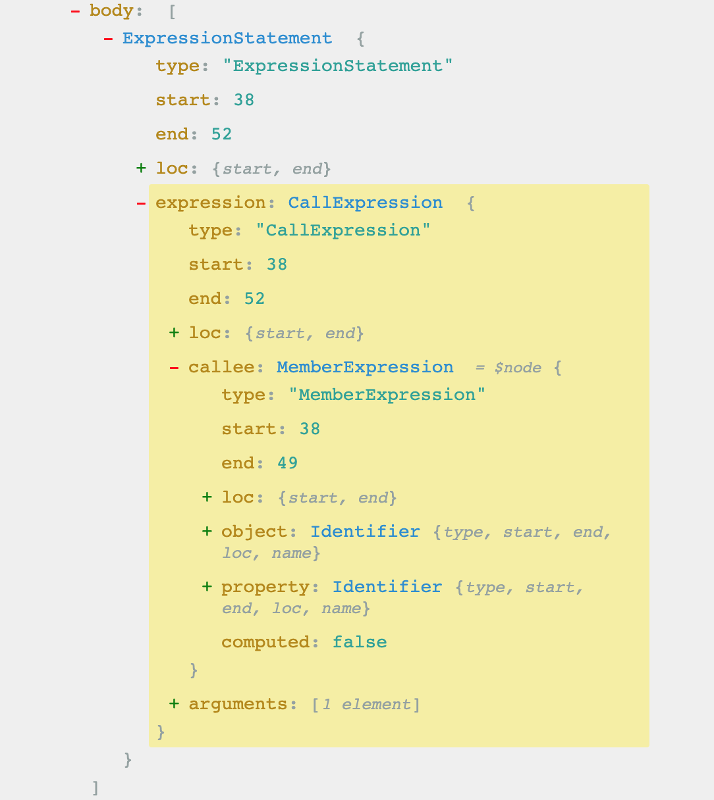
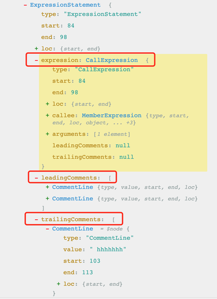
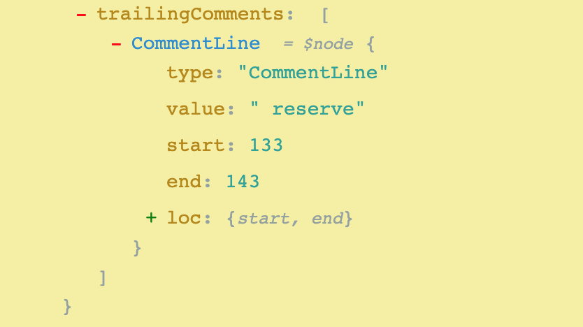
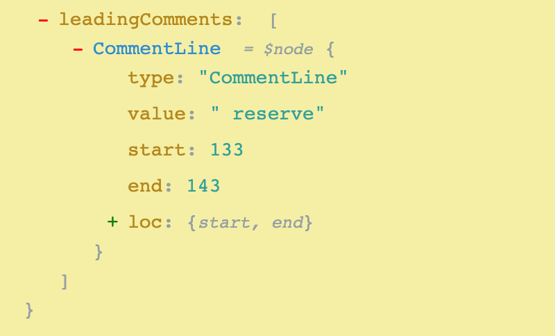

# babel-plugin-console

## 前言

在之前的一篇[文章](../babel/readme.md)中，介绍了babel的基本的概念，以及如何写一个简单的babel插件，这篇文章中就实现一个在生产环境中去掉 `console` 的插件 `babel-plugin-console`

有如下代码，我们要把函数中的 `console`语句去掉。
```js
function code(x) {
  if (true) { 
    console.log(x)
  }
  console.log(x)
  return x * x
};
```

这段代码在[astexplorer](https://astexplorer.net/#/Z1exs6BWMq)解析后得到的 **ast**如下：



### 版本1

基于此，这里先初步实现一版，去掉 `console`即可：

```js
module.exports = ({ types: t, template }) => {
  return {
    visitor: {
      CallExpression(path, state, scope) {
        if (
          path.node.callee &&
          t.isIdentifier(path.node.callee.object, { name: "console" })
        ) {
          path.remove()
        }
      },
    },
  };
};
```
这里判断如果是 `console`语句，直接使用 `path.remove()` 删除即可

最终得到的结果如下：

```js
function code(x) {
  console.log(x) 
  if (true) {
  }
  return x * x
};
```
发现 `console`语句都可被去掉

### 版本2

上面一版本是去掉所有的 `console`语句，非常简单直接。但是在有些情况下，我们需要保留某些 `console`语句供线上调试使用，这时候我们约定，通过给 `console`语句添加特定注释，以确保不会被去掉。

```js
function code(x) {
  console.log(x) 
  if (true) {
    // 其他注释
    // no remove
    console.log(x)
    // hhhhhhh
    console.log(x) // reserve
    console.log(x)
  }
  return x * x
};
```

如上所示：

- 第一条 `console` 没加上注释，期望被删掉
- 第二条 `console` 有多条前置注释，其中有一个 `no remove`的注释，期望该条 `console`被保留
- 第三条 `console` 有一条非保留前置注释，但是有一个 `reserve`的后置保留注释
- 第四条 `console` 没有加上任何注释，期望被删掉

基本上，这四种情况可以涵盖了所有的注释情况了(这里先不考虑块注释)。生成的 `ast`如下：



可以发现，在生成的ast中，注释并没有被表示成一个独立的节点类型，而是被当作了一个 `node`节点的属性。所以这里我们就判断一下，当前节点的 **前置注释(leadingComments)** 和 **后置注释(trailingComments)** 是否有保留的字段，如果都没有保留的字段，那么就删除掉该节点即可，实现如下：

```js
function removeConsoleExpression(path, state) {
  const parentPath = path.parentPath;
  const node = parentPath.node;

  let leadingReserve = false;
  let trailReserve = false;

  if (hasLeadingComments(node)) {
    // 遍历所有的前缀注释
    node.leadingComments.forEach((comment) => {
      // 有保留字 并且不是上个兄弟节点的尾注释
      if (isReserveComment(comment, state)) {
        leadingReserve = true;
      }
    });
  }
  if (hasTrailingComments(node)) {
    // 遍历所有的后缀注释
    node.trailingComments.forEach((comment) => {
      // 有保留字 并且是本行的
      if (isReserveComment(comment, state)) {
        trailReserve = true;
      }
    });
  }
  if (!leadingReserve && !trailReserve) {
    path.remove();
  }
}
```

最终得到的结果如下：

```js
function code(x) {
  if (true) {
    // 其他注释
    // no remove
    console.log(x);
    // hhhhhhh
    console.log(x); // reserve
    console.log(x);
  }
  return x * x;
};
```

我们发现：

- 第一条可正常删除
- 第二条和第三条如期望一样被保留了下来
- 第三条却出现了意外，没有加上任何保留注释，却没有被去掉。

第三天没有被去掉是什么原因呢？通过观察 `ast`的结果发现，**第三条console尾部的reserve注释同时也是第四条语句的头部注释**：

**trailComments**


**leadingComments**


### 版本3

所以，这就需要在遍历时注意：

- 遍历 **leadingComments** 的时候需要注意，它时候含有上个兄弟节点的保留注释
- 遍历 **trailComments** 的时候，要注意如果当前尾部包含保留注释，需要对其进行标记，以便于下个兄弟节点决定是否删除节点的时候可以排除这个影响因素

```js
function removeConsoleExpression(path, state) {
  const parentPath = path.parentPath;
  const node = parentPath.node;

  let leadingReserve = false;
  let trailReserve = false;

  if (hasLeadingComments(node)) {
    // 遍历所有的前缀注释
    node.leadingComments.forEach((comment) => {
      // 有保留字 并且不是上个兄弟节点的尾注释
      if (isReserveComment(comment, state) && !comment.belongPrevTrail) {
        leadingReserve = true;
      }
    });
  }
  if (hasTrailingComments(node)) {
    // 遍历所有的后缀注释
    node.trailingComments.forEach((comment) => {
      const {loc: { start: { line: commentLine }}} = comment;
      // 标记下一个sibling节点遍历的key
      nextSibilingKey = parentPath.key + 1;

      // 对于尾部注释 需要标记出 该注释是属于当前的尾部 还是属于下个节点的头部 通过其所属的行来判断
      const {loc: { start: { line: expressionLine }}} = node.expression;
      if (commentLine === expressionLine) {
        comment.belongPrevTrail = true;
      }
      // 有保留字 并且是本行的
      if (isReserveComment(comment, state) && comment.belongPrevTrail) {
        trailReserve = true;
      }
    });
  }
  if (!leadingReserve && !trailReserve) {
    path.remove();
  }
}
```
如上所述，关键在于 **主要通过注释所在的行和 `console`所在的行来判断，此注释是属于当前 `console`的尾部注释，还是属于下个兄弟节点的头部注释**。如果是尾部注释就标记出来：

```js
if (commentLine === expressionLine) {
  comment.belongPrevTrail = true;
}
```
如此一来，删除节点的逻辑就变得清晰了：

- 遍历前置注释，只需要知道该注释含有约定的保留字段，并且它不是上个兄弟节点的尾部注释
- 遍历后置注释，只需要判断该注释包含约定的保留字段，并且它是当前节点的尾部注释

最终得到的就是我们想要的结果了

## 测试

测试可以使用两种方法

1. 使用 `babel-core`提供的api

这里需要安装 `bable-core`和 `babel-cli`

```js
const babel = require("babel-core");
const consolePlugin = require("../plugins/consolePlugin")

const result = babel.transform(code, {
  plugins: [[consolePlugin, { removeMethods: null }]]
});
```
`package.json`中添加脚本：
```js
{
  "scripts": {
    "console": "NODE_ENV='production' babel-node ./test/console.js",
  },
}
```

2. 使用 `babel-cli` 

添加.babelrc 文件

```js
{
  "plugins": ["./plugins/2consolePlugin"]
}
```
`package.json`中添加脚本：
```js
{
  "script": {
    "babel": "NODE_ENV='production' babel ./test/console.js",
    "babel2": "NODE_ENV='production' babel ./test/console.js -o result.js",
  }
}
```
这两个脚本的区别是：

- 脚本1可将编译结果输出到控制台，
- 脚本2将结果输出到 `result.js`文件中

完整项目地址：[点这里](https://github.com/MinjieChang/babel-analys/blob/master/plugins/2consolePlugin.js)

refer:<br/>
[babel-plugin-remove-console](https://github.com/jinggee/babel-plugin-remove-console/blob/master/src/index.js)