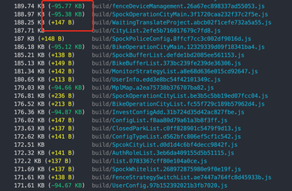

# babel-plugin-lodash-import

实现 `lodash`按需加载的 `babel`插件

## 前言

在平时的开发中，我们一般习惯使用这种方式导入 `lodash`：

```js
import lodash from "lodash";

lodash.debounce()
```
这种导入方式会将 `lodash`上的所有的方法都导入到文件中，导致文件的打包体积比较大。实际上，对于 `lodash`上绑定的属性方法，`lodash`仓库中都提供了一个对应的文件来导出此方法，如此，对于上面的导入方式，一个优化方式是修改成这样：

```js
- import lodash from "lodash";
+ import debounce from "lodash/debounce";

- lodash.debounce()
+ debounce()
```

我们只导入了需要使用到的方法 `debounce`，刨除掉了其他的方法，这会大幅减少打包后的文件体积

## 插件转化

对于开发者而言，当然更喜欢采用简单的导入方式，怎么方便怎么来，但是这样又导致了打包的文件体积过大，那么有什么办法可以兼顾到这二者呢，既想书写方便，又期望减小打包体积？ `babel`插件此时就可以发挥作用了，在打包的时候悄无声息的把代码替换一下即可。这里借鉴 `antd` 的 `babel-plugin-import`的实现思路。

## 实现

这里要解决的问题主要有两个

1. 转换导入的方式

把 `import lodash from "lodash";`转化成 `import xxx from "lodash/xxx";`

2. 转换调用的方式

把 `lodash.debounce()` 转换成 `debounce()`的方式调用

实际上，这两个问题可以合并一下，当碰到 `import lodash from "lodash";`这个语句的时候，直接从 `ast`树中删除掉即可，当碰到 `lodash.debounce()`这个语句时候需要做两个事情：

1. 在文件头部插入 `import xxx from "lodash/xxx";`这样的语句
2. 修改调用语句为 `xxx()`

接下来实现起来就比较简单了

### import xxx from 'lodash'

首先处理 `import lodash from 'lodash'` 或 `import _ from 'lodash'` 这样的导入语句

当碰到这样的导入语句时候就删除掉：

```js
ImportDeclaration(path, state, scope) {
  const specifiers = path.get("specifiers");
  const source = path.get("source");
  if (
    specifiers && specifiers.length === 1 &&
    t.isImportDefaultSpecifier(specifiers[0]) &&
    (t.isIdentifier(specifiers[0].node.local, { name: "lodash" }) || t.isIdentifier(specifiers[0].node.local, { name: "_" })) &&
    t.isStringLiteral(source.node, { value: "lodash" })
  ) {
    path.remove()
  }
}
```

然后对于类似 `lodash.debounce()`调用，使用如下方法：

```js
{
  pre(state) {
    this.propertyNames = [];
    this.fpPropertyNames = [];
    this.namespaceSpecifier = [];
    this.moduleVals = ['lodash', '_']
  },
  visitor: {
    CallExpression(path, state, scope) {
      if (
        path.node.callee && path.node.callee.object &&
        this.moduleVals.includes(path.node.callee.object.name)
      ) {
        const propertyName = path.get("callee.property").node.name;
        if (!this.propertyNames.includes(propertyName)) {
          // 把属性名存储起来，方便后续添加导入语句
          this.propertyNames.push(propertyName);
        }
        path.get("callee").replaceWith(t.identifier(propertyName));
      }
    },
  }
}
```
主要方法是这么两句：

1、把 `lodash`的属性名存储起来，方便后续添加导入语句 `import xxx from 'lodash/xxx'`
```js
this.propertyNames.push(propertyName);
```

2、替换语句
```js
path.get("callee").replaceWith(t.identifier(propertyName));
```

### 添加导入语句

在上面的代码中，我们把 `lodash`的属性方法 `propertyName` 存储到 `this.propertyNames`变量中，现在要使用这些变量在文件头部插入导入语句：

```js
import xxx from "lodash/xxx"
```

具体实现如下：

```js
module.exports = ({ types: t, template }) => {
  return {
    // ...
    post(state) {
      this.propertyNames.forEach((name) => {
        state.path.node.body.unshift(buildImportDeclaration(t, name, `lodash/${name}`));
      });
    },
  };
};

function buildImportDeclaration(t, name, source) {
  return t.importDeclaration(
    [t.importDefaultSpecifier(t.identifier(name))],
    t.stringLiteral(`${source}`)
  );
}
```

`post`方法会在插件遍历完文件后执行，在此方法中，遍历了 `this.propertyNames`，对于每一个属性名执行 `buildImportDeclaration`函数，这个函数的作用就是创建一个 `import`节点，具体使用方法可参考[babel-types/import](https://babeljs.io/docs/en/babel-types#import)

### 全量导入

以上情况处理了默认导入 `import lodash from 'lodash'`，还会存在一些其他的导入方法，比如全量导入：

```js
import * as lodash from 'lodash'

lodash.debounce()
```

对于这种情况处理方式和上面的也很类似，需要修改两个地方

1. 遍历到全量导入的情况需要删除此节点，并把导入的变量存储起来，方便后续在调用语句中判断，是否使用了了该导入变量中的方法：

```js
// import * as lodash from 'lodash'
ImportDeclaration(path, state, scope) {
  if (
    specifiers && specifiers.length === 1 &&
    t.isImportNamespaceSpecifier(specifiers[0]) &&
    t.isStringLiteral(source.node, { value: "lodash" })
  ) {
    // 存储全量导入的变量名
    this.namespaceSpecifier.push(specifiers[0].node.local.name)
    path.remove()
  }
}
```

2. 遍历到调用语句，需要添加这个判断 `this.namespaceSpecifier.includes(path.node.callee.object.name)`，这种情况也是需要添加导入语句的

```js {4, 5}
CallExpression(path, state, scope) {
  if (
    path.node.callee && path.node.callee.object &&
    (this.moduleVals.includes(path.node.callee.object.name) || this.namespaceSpecifier.includes(path.node.callee.object.name))
  ) {
    ...
  }
},
```

## 收效

这里展示一下在项目中实际使用此插件的效果。

使用插件前的打包文件：


使用插件后：



可以发现，使用插件后，在引入了lodash的文件打包后可以减少 `90kb` 左右的体积，收益还是挺明显的。

## 总结

以上就是一个 `lodash`插件的全部内容了，总的来说还是比较容易的，主要还是需要对 `babel`的概念和相关 `api`有一定的了解。

实际上官方也提供了一个类似功能的插件 [babel-plugin-lodash](https://www.npmjs.com/package/babel-plugin-lodash)，实际使用建议使用官方插件，此插件可作为学习实践材料。

本文代码地址可在此[查看](https://github.com/MinjieChang/babel-plugin-lodash-import)