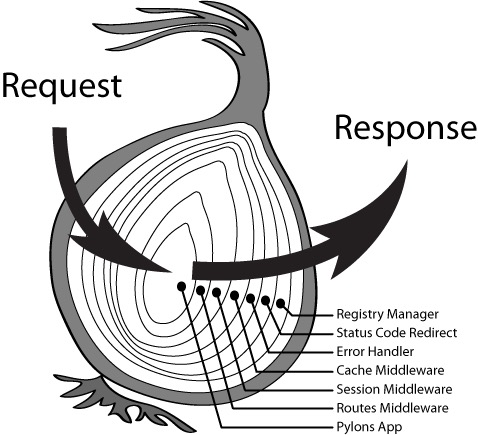
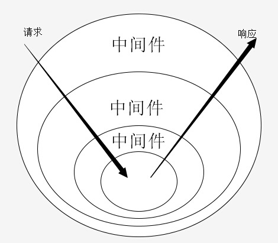
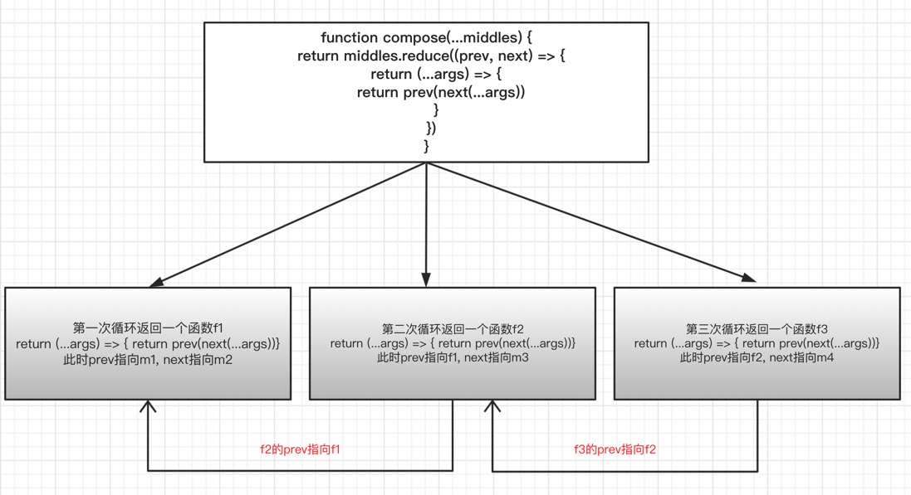

# koa2 中间件的实现分析及实现自己的中间件组合方式

## 前言

对于koa2的源码解析其实网上有很多的文章（为了方便起见，以下用koa来代指koa2），所以在这篇文章里我们不探讨koa的具体实现，我们想看看koa中的中间件的组织方式，以及受这种组织方式的启发，我们模拟实现另外一种的组织方式，及可以用到的一些场景

## koa的基本使用

了解之前，我们先看一下，它是如何使用的

```js
cont Koa = require('koa')
const app = new Koa()

app.use(async function m1(ctx, next){
    console.log('m1 start')
    await next()
    console.log('m1 end')
})

app.use(async function m2 (ctx, next){
    console.log('m2 start')
    await next()
    console.log('m2 end')
})

app.listen(3000, function(){})

```
通过调用，我们发现，打印的结果依次是：
- m1 start
- m2 start
- m2 end
- m1 end

也就是，在m1的执行过程中，当执行到next()的时候，会来到m2中，当m2执行完后再回到m1中执行。其实，这也是一种典型的递归的执行顺序，这种函数嵌套执行的方式也被称作洋葱模型。

学习 `koa-compose` 前，先看两张图。





第一张图是著名的洋葱模型图，第二张是洋葱模型中间件的示意图，有没有发现，中间件示意图很像是我们的`装饰者模式`中的模型, 具体可参考[aop模式](https://minjiechang.github.io/designPattern/aop/)

## 实现简易的中间件组织模型
知道了koa的中间件模型要做的事情是，将这些中间件函数组织起来执行，并将后一个中间件函数作为参数传递给上一个中间件函数，分析如下：

```js
// 定义中间件
const m1 = function (ctx, next){

}
const m2 = function (ctx, next){

}
const m3 = function (ctx, next){

}
// 当 m1 执行的时候，我们需要得到下面这样的结构
m1(ctx, () => m2(ctx, () => m3(ctx, () =>{})))

```

对于这种结构，我们可以想到使用递归的方式来模拟这种结果
```js

// 使用一个数组来存放所有的中间件
const middlers = [m1, m2, m3];

function dispatch(i) {
    return midders[i](ctx, () => dispatch(i+1))
}

dispatch(0)
```

为了支持接收ctx参数，我们使用一个高阶函数来做
```js
function compose(middles){
    return function(ctx){
        function dispatch(i){
            if (i === middles.length) {
                return
            }
            return middles[i](ctx, () => dispatch(i+1))
        }
        return dispatch(0)
    }
}
compose(midders)(ctx)
```
至此，我们就模拟实现了一个自执行的中间件组合方式，当然如果要更完善它，还可以再加上错误捕获

```js
try {
    compose(midders)(ctx)
} catch(error) {

}
```
如果要验证的话，可以使用上面的几个中间件函数来验证一下，这里我们就不再赘述。

## koa的中间件组织方式

上面的部分我们是模拟实现了一下中间件的组合，那么我们来简单扒一下koa的源码，看下它是如何实现将这些中间件组合在一起的，我们这里只是将大概的结构梳理出来

```js
class Emitter{
  // node 内置模块
  constructor(){
  }
}
class Koa extends Emitter{
  constructor(options){
    super();
    options = options || {};
    this.middleware = [];
    this.context = {
      method: 'GET',
      url: '/url',
      body: undefined,
      set: function(key, val){
        console.log('context.set', key, val);
      },
    };
  }
  use(fn){
    this.middleware.push(fn);
    return this;
  }
  listen(){
    // 在这里使用了compose函数对中间件进行了组合
    const  fnMiddleware = compose(this.middleware);
    const ctx = this.context;
    const handleResponse = () => respond(ctx);
    const onerror = function(){
      console.log('onerror');
    };
    fnMiddleware(ctx).then(handleResponse).catch(onerror);
  }
}
function respond(ctx){
}
```

### 看下它的compose源码实现
```js
function compose (middleware) {
 //  传入对象 context 返回Promise
  return function (context, next) {
    // last called middleware #
    let index = -1
    // 从第一个中间件开始执行
    return dispatch(0)
    function dispatch (i) {
      if (i <= index) return Promise.reject(new Error('next() called multiple times'))
      index = i
      let fn = middleware[i]
      if (i === middleware.length) fn = next
      if (!fn) return Promise.resolve()
      try {
        // 主要的区别在这里
        return Promise.resolve(fn(context, dispatch.bind(null, i + 1)));
      } catch (err) {
        return Promise.reject(err)
      }
    }
  }
}
```
通过比较它的源码，我们发现跟我们实现的主要区别在于，每个midder返回的结果都用`Promise`包裹了一下，至于为什么要这么做，我个人认为主要是为了支持es6的async await的中间件编写方式，中间件中的异步任务可以采用Promise的方式返回，避免使用回调嵌套的方式。

按照我们之前的分析，返回Promise的中间件的执行顺序类似下面这样：
```js
const p = Promise.resolve(m1(ctx, function next(){
    return Promise.resolve(m2(ctx, function next(){
        return Promise.resolve(m3(ctx, function next(){
            return Promise.resolve()
        }))
    }))
}))
```

这种结构对于错误捕获也是非常的便利
```js
p.then(handleResponse).catch(onError)
```

## 和redux中间件的区别
其实，熟悉redux的同学也应该都知道，redux也有自己的一套中间件组织模式，那么我们来看一下redux是如何来做的

```js
// 定义几个中间件
let d1 = (store) => (dispatch) => (action) => {
    // balabala
}
let d2 = (store) => (dispatch) => (action) => {
    // balabala
}
let d3 = (store) => (dispatch) => (action) => {
    // balabala
}
```
redux的方式是使用`柯里化`的方式，将每个参数都抽离出来，而不是将多个参数统一传递给目标函数，这种方式其实是更复杂化的。关于`柯里化`下次会专门来讲一下

redux在内部会对这些中间件传入store执行一次，执行后会返回一个高阶函数，实际上每个中间件类似这样：
```js
let dispatch = (action) => {}

d1 = (dispatch) => (action) => {}
d2 = (dispatch) => (action) => {}
d3 = (dispatch) => (action) => {}

// 最终的dispatch函数会成为这样
dispatch = d3(d2(d1(dispatch)))
```
有没有发现上面的这个配方很熟悉的感觉？没错，它就是我们上面的第二张`洋葱模型中间件模型`图，说白了也是装饰器模式的实现。
实际上，观察这个结构我们发现，这里的dispat实际上就类似于koa中间件的next，action就类似ctx，只是redux将这些参数拆开到每个函数中

现在，redux要解决的问题是如何将这些高阶函数组织起来，实际上redux也是提供了这么一个compose函数，这里我们就直接给出这个函数的实现，后面再看如何实现这个compose函数

```js
function compose (...fns) {
  if (fns.length === 1) {
    return fns[0]
  }
  return fns.reduce((prev, next) => {
    return (...args) => next(prev(...args))
  })
}

const newDispatch = compose([d1, d2, d3])(dispatch)

```
这个函数非常精简，一眼看上去很懵，但是经过分析后发现，它内部无非就是使用reduce方式实现的函数的递归调用


这个其实是使用递归的思路实现：
- 每次执行都会返回一个新的函数，其中下一次返回的函数中的prev都指向上一次的返回的函数，意味着
- 第一次执行返回的函数叫f1, 其中prev为m1，next为m2
- 第二此返回的为f2, 其中prev指向了f1，next指向了m3
- 当f2执行的时候，传入action参数，首先m3先执行，将返回的结果传给了f1，
- f1执行中，先执行了m2，再将结果传给了m1
- 所以最终的执行顺序依然是m1(m2(m3(action)))

实际上，此compose函数的逻辑就是，对原始的dispatch函数使用高阶函数来一层层进行装饰，从而生成最终的一个dispatch函数。拿洋葱模型来看，其中，装饰的过程就是洋葱模型中从外层一层层到最里层生成一个新的newDispatch函数(`d3 > d2 > d1 > dispatch`)，而执行newDispatch的过程就是从洋葱的内部一层层向外层执行的过程(`dispatch > d1 > d2 > d3`)。

> 小总结：

分析这个函数后，我们也能发现，有些函数的写法非常的抽象，面对这些咋一看让人摸不着头脑的东西时，我们只有把那些`抽象的`、`看不见的代码`给具象出来，才能看清楚它们的本质。

### 二者区别
- 二者的中间件结构不同，redux的是一种高阶函数的方式，而koa只是普通函数的结构
- redux的中间件结构更像是一种装饰器模式，对源函数装饰后再逐层传递一层层装饰的过程，而koa使用的是参数传递的方式向下执行中间件，当然这两者对于执行的内存消耗和时间长度还未进行考证，暂未确定哪种方式效率更高。

## 实现自己的compose
上面总结了两种中间件的组织方式，其实，受promise的链式调用的启发，我们还可以再实现一版Promise版本的中间件组织模式

在promise的链式调用中，当上个then方法中返回promise时，只有当此promise状态置为resolve，其后面的then的回调才会执行。那么我们可以把每个中间件放到then的回调中，类似这样

```js
function myCompose(middles){
    return (ctx) => {
        Promise.resolve(ctx).then(() => {
            return new Promise((resolve, reject) => {
                m1(ctx, resolve, reject)
            })
        }).then(() => {
            return new Promise((resolve, reject) => {
                m2(ctx, resolve, reject)
            })
        }).then(() => {
            return new Promise((resolve, reject) => {
                m3(ctx, resolve, reject)
            })
        })
    })
}

```
然后，使用起来就类似这样：

```js
// 中间件函数定义
const m1 = function(ctx, resolve, reject){
  // 在这里面可以做一些异步的操作
  setTimeout(() => {
    // 这里执行了resolve，继续执行下个中间件
    resolve()
  })
}
const m2 = function(ctx, resolve, reject){
  setTimeout(() => {
    // 这里执行了reject，就不会继续再向下执行中间件，并且错误将被compose函数捕获到
    reject()
  })
}
const m3 = function(ctx, resolve, reject){
  console.log('m3')
}

// 使用compose函数
// 所有的中间件都resolve后，执行handleResponse函数，否则走到catch
myCompose(middles)(ctx).then(handleResponse).catch(onError)
```

使用reduce方法，实现函数的链式调用，自动将所有的中间件组织起来，避免再手动调用，优化后如下：

```js
function myCompose(middles){
    return (ctx) => {
        return middles.reduce((p, n) => {
            return p.then(() => {
                return new Promise((resolve, reject) => {
                    // 主要是这里
                    n(ctx, resolve, reject)
                })
            })
        }, Promise.resolve()).then(() => ctx)
    }
}
   
```
每次迭代都返回一个promise.then，并且在then中返回一个新的promise实例，在此promise实例中，包裹了中间件函数，并且将promose实例的resolve和reject作为参数传递给中间件，也就是将then链条的执行权交给了中间件函数。
这里的n就是一个中间件，将resolve当参数传给中间件，当resolve执行后才会执行下个中间件

最后的then回调中使用 () => ctx 是为了将ctx传递出去

## 运用场景
这种链式调用方法对于表单的验证提交很有效果：

```js
// 校验方法
const v1 = (value, resolve, reject) => {
  console.log(value.age)
  if(value.age > 18){
    // 这里修改了age的值
    value.age = 30
    resolve()
  } else {
    reject()
  }
}
// 校验方法
const v2 = (value, resolve, reject) => {
  console.log(value.age)
  if(value.name === 'rose'){
    resolve()
  } else {
    reject()
  }
}
// 提交方法
const submit = (value) => {
  console.log(value.age)
  api.post(value)
}

const value = {name: 'rose', age: 20}
myCompose(v1, v2)(value).then(submit).catch(()=>{})
```
上面的打印依次是：20 、30 、30

## 总结
上面，我们总结了几种常用的函数的链式调用方法，分别为：

- koa的compose方法
- redux的compose方法
- 我们自己实现的compose方法

其中，koa和redux的comose方法比较类似，基于递归的方式实现，我们实现的myCompose方法是基于promise的then的链式调用的基础上。传递给中间件的参数是`resolve`和`reject`，而不是下个中间(`next`)

然后，基于这种链式调用，总结了几种适用场景，这种链式调用调用对于多层条件的判断的场景下比较适用，比如表单的验证，查找目标对象等等。

**Reference**

[学习 koa 源码的整体架构](https://juejin.im/post/5e69925cf265da571e262fe6#heading-0)<br/>
[使用四十行代码实现一个核心 koa](https://juejin.im/post/5e72b1e8e51d4526e8081022)<br/>
[知乎@姚大帅：可能是目前市面上比较有诚意的Koa2源码解读](https://zhuanlan.zhihu.com/p/34797505)<br>
[IVWEB官方账号: KOA2框架原理解析和实现](https://ivweb.io/article.html?_id=100334)<br>