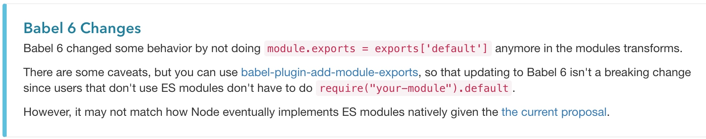

# import、export，require、exports模块化分析

## 前言

在使用`antd`组件的过程中，发现在其库中经过编译后的代码是这样的形式：

```js
var _button = _interopRequireDefault(require("antd/lib/button"));

function _interopRequireDefault(obj) { return obj && obj.__esModule ? obj : { default: obj }; }

```
在编译后的文件中加上了 `_interopRequireDefault` 这个函数，该函数的逻辑也很简单，判断 `obj`参数时候有 `__esModule`属性，有就返回该对象，没有就返回包装过的新对象 `{ default: obj }`，这个函数是babel编译加上的，那babel为什么要这么做呢？

带着这个问题，本文试着来解析一下 `babel` 在解析模块化语句中做了哪些事情。

目前前端模块化，常用的就是 `commonjs` 的 `require`、`exports`实现的模块化，及 `es6`实现的 `import`、`export`导入导出的方式，并且对于模块化的实现，`webpack`和 `babel`都有自己的方式，现在我们分别看一下他们各自如何实现的。

## babel 模块实现

babel可以看成是 `javascript`语法的编译器，用来将 `es6`的语法翻译成 `es5`的语法，这也包括对于est6的模块化语法的转换。

在看之前，这里先抛出几个问题帮助我们思考babel做的工作

1. **babel将es6的导入导出语法转换成了什么？**
2. **es6的导入导出有多种写法，bable是如何处理这些不同的情况的？**
3. **为什么使用require的方式导入一些文件需要加上 `default`, 而有的导入就不需要呢？**

这里通过起一个小项目来解析这些问题。项目地址可以在[这里](https://github.com/MinjieChang/module)查看

首先起一个项目并安装babel编译环境：

```shell
npm i babel-cli babel-preset-es2015 -D
```

### babel编译导出

定义 `a.js` 文件：

```js
const b = 3;
const c = 4;

export const a = 123;
export { b, c };
export default 123;
```

在 `a.js` 中，使用es6的语法，导出了三个变量，及一个默认default导出，使用babel先编译下 `a.js`：

```js
"build_export": "babel a.js -o compiledA.js",
```
输出结果如下：

```js
"use strict";

Object.defineProperty(exports, "__esModule", {
  value: true
});
exports.default = 123;
var a = exports.a = 123;

var b = 3;
var c = 4;
exports.b = b;
exports.c = c;
```
可以看出，**babel将es6的导入导出语句转换成了commonjs的写法了**，需要注意的是，将es6的默认输出 `export default` 挂载到了 commonjs的 `exports.default`变量上，并且在 `exports` 上定义了 `__esModule` 属性，表面此文件导出的是es6的模块

### babel编译默认导入

然后再定义 `index.js`，并在此文件中引入 `a.js`

```js
import a from './a.js';

console.log(a);

export default 'a.js';
```

编译 `index.js` 结果如下：

```js
'use strict';

Object.defineProperty(exports, "__esModule", {
  value: true
});

var _a = require('./a.js');

var _a2 = _interopRequireDefault(_a);

function _interopRequireDefault(obj) { return obj && obj.__esModule ? obj : { default: obj }; }

exports.default = 'a.js';

console.log(_a2.default);
```
可以发现，编译后的文件和在文章开始给出的代码很像，那为何babel要引入 `_interopRequireDefault` 这个函数，加工一下我们 `require` 的内容呢？然后最终引用的是 `_a2.default`呢？，这是由于：

- es6的 `import a from './a.js';`，本意是要引入 `a.js`的默认输出即 `export default`，bable转换后变成了 `var _a = require('./a.js');`，对于原始的es6模块，使用babel编译后 `export default`的输出被挂载到了 `exports.default`上，而使用 `require`导入的是整个 `exporst`对象，所以导入需要加上 `default`字段；而对于原始的 `commonjs`模块，由于模块中没有输出 `default`属性，所以需要将原始的输出 `exports`对象复制给一个新对象的 `default`属性，然后再导出，这个过程也就是 `_interopRequireDefault` 辅助函数做的事情。

### babel编译全量导入

对于es6的 `import * as a from 'xxx'`导入方式，本意是要引入es6模块的所有命名输出包括 `default`输出打包成一个对象赋值给 `a`属性，对于这种情况，当我们在引入一个es6模块和commonjs模块的时候，babel是如何做的呢？

使用babel编译如下代码：

```js
import * as a from './a.js';
console.log(a)
```

得到的结果如下：
```js
var _a = require("./a.js");

var a = _interopRequireWildcard(_a);

function _interopRequireWildcard(obj) {
  if (obj && obj.__esModule) {
    return obj;
  } else {
    var newObj = {};
    if (obj != null) {
      for (var key in obj) {
        if (Object.prototype.hasOwnProperty.call(obj, key))
          newObj[key] = obj[key];
      }
    }
    newObj.default = obj;
    return newObj;
  }
}
console.log(a);
```
我们发现此时多了一个 `_interopRequireWildcard` 辅助函数，这个函数主要对模块类型做了判断：

- 通过 `obj.__esModule`判断模块是否为es6模块，如果是，直接返回该模块
- 否则如果不是es6模块，那么会把模块内的所有具名导出赋值给一个新的对象 `newObj`，最后再把原始对象 `obj`赋值给新对象 `newObj`的 `default`属性，最终返回此新对象。

对这两种情况我们尝试分析一下：

- `import * as a from './a.js';` 要导入模块的全部输出。对于es6模块，babel编译后已经包含了所有的具名输出和 `default`输出：
  ```js
  exports.default = 123;
  var a = exports.a = 123;

  var b = 3;
  var c = 4;
  exports.b = b;
  exports.c = c;
  ```
  这种输出方式符合了es6这种导入方式的意图，所以直接返回原始模块即可。

- 对于commonjs模块，模块已经输出了所有具名属性，只是没有输出 **default** 属性，所以babel的处理方式就是把模块的整体输出赋值给一个新对象的default属性，`newObj.default = obj;` 。

### babel编译变量导入

es6的导入代码如下：

```js
import { a, b, c } from './a.js'

console.log(a, b, c)
```

这种方式从引入的模块中导入三个变量，babel编译的结果：

```js
var _a = require('./a.js');

console.log(_a.a, _a.b, _a.c);
```

由于 `require`加载的是整个 `exports`对象，babel没有做特殊的转换，只需要获取对应的属性即可

以上三种导入方式基本上涵盖了es6的常用导入方式，这也基本上回答了上面提出的[问题2](#babel-模块实现)。

### require 导入

commonjs的导入使用 `require` 方式，但是我们通常会碰到在 `require`一些模块的时候需要加上 **default**，有的时候又不需要加上，这是为什么呢？

```js
const babylon = require("@babel/parser");
const traverse = require("@babel/traverse").default;
```

**通常这种情况出现于使用require的方式导入es6的模块**，由于es6的 `export default xxx` 会被编译成 `exports.default = xxx`，所以使用 require 的方式导入需要加上 `require(xxx).default`

而使用 es6 的import导入不需要加上default，这是由于babel在编译es6导入的时候会加上 `_interopRequireDefault` 这个辅助方法，对于引入的es6或commonjs模块都加上了 `default` 属性

这个场景通常会在写 webpack 代码分割逻辑时经常会遇到。

```js
require.ensure([], (require) => {
  callback(null, [
    require('./src/pages/profitList').default,
  ]);
});
```

实际上，这是babel6之后做的变更，在babel5中可不是这样的：



在babel5时代，开发者使用require引入es6的模块的default输出，习惯性的认为require进来的就是模块的默认输出，所以babel5对这个逻辑做了hack处理，当一个模块中只有default输出的情况下，babel5会将模块的默认输出赋值给 `module.exports` 对象，也就是导入的全部内容就是模块的default输出了，这样，在我们require一个es6模块的时候就不需要加上default属性了：

```js
var default = exports.default
module.exports = default
```

这样的一个问题是，这么hack的方式其实是不符合es6的本意的，es6中default输出其实也只是输出的一个default变量，和普通的变量输出没有区别

```js
export default 'a'
export const b = 'b'

// 引入
import { default as a, b }
```

还有一个潜在的问题是，在一个本来只有默认输出的模块中，再加上输出其他的具名变量，这样就会导致引入的结果发生变化：

```js
// a.js
export default 'a'
export var b = 'b' // 新增
```
引入：

```js
var a = require('./a.js' )

// 之前的引入结果是 ‘a’
// 现在的引入结果变为 { default: 'a', b: 'b' }
```
所以在babel6中就去掉了这个hack方法，所以在使用require导入es6的默认输出的时候需要加上default属性。如果你觉得加上比较麻烦，可以引入 **babel-plugin-add-module-exports** 这个插件即可。

这也就回答了上面提到的[问题3](#babel-模块实现)

以上是对babel模块化解析的部分，相信看到这里的你应该对es6和commonjs的模块混用的原理有了一定的认识了。

这部分的代码可在[这里查看](https://github.com/MinjieChang/module/tree/master/babel-module)
## webpack 模块化的原理

webpack在进行打包的过程中对于模块化的解析也是实现了自己的一套方式。这里以webpack3为例，首先安装webpack并添加配置文件如下：

```js
const path = require('path');
module.exports = {
  entry: './index.js',
  output: {
    path: path.resolve(__dirname, 'dist'),
    filename: 'bundle.js',
  },
};
```
index.js的文件如下：

```js
import { a } from './a.js';
console.log(a);
export default 'index.js';
```

a.js的文件如下：

```js
export var a = 333;
export var b = 222
```
使用webpack打包后得到的结果如下，这里省略了部分代码：

```js
(function (modules) {
  var installedModules = {};

  // The require function
  function __webpack_require__(moduleId) {
    // Create a new module (and put it into the cache)
    var module = (installedModules[moduleId] = {
      i: moduleId,
      l: false,
      exports: {},
    });

    // Execute the module function
    modules[moduleId].call(module.exports, module, module.exports, __webpack_require__);

    // Return the exports of the module
    return module.exports;
  }

  // Load entry module and return exports
  return __webpack_require__((__webpack_require__.s = 0));
})(
  [
    /* 0 */
    function (module, __webpack_exports__, __webpack_require__) {
      "use strict";
      Object.defineProperty(__webpack_exports__, "__esModule", { value: true });
      var __WEBPACK_IMPORTED_MODULE_0__a_js__ = __webpack_require__(1);

      console.log(__WEBPACK_IMPORTED_MODULE_0__a_js__["a"]);

      __webpack_exports__["default"] = "index.js";
    },
    /* 1 */
    function (module, __webpack_exports__, __webpack_require__) {
      "use strict";

      __webpack_exports__["a"] = "a";

      var a = 333;
      var b = 222;
    },
  ]
);
```
可以看到打包后得到的是个自执行函数，分别来解析函数体和参数部分，先来看函数体内。

在函数内部定义了 `__webpack_require__`函数，这个函数就是webpack用于导入模块的方法，先看看这个函数干了什么事情。

1. 在函数内定义了module对象，及定义了值为对象的exports属性

```js
var module = { i: moduleId, l: false, exports: {} });
```

2. 接着执行对应的模块方法，并传入三个参数

```js
modules[moduleId].call(module.exports, module, module.exports, __webpack_require__);

// modules[moduleId] 表示从参数中取出对应的模块
// 再传入 module, module.exports, __webpack_require__ 这三个参数
```

3. 最后再把 `module.exports` 返回出去。

以上是 __webpack_require__ 内部的过程。

在自执行的函数体内执行了 `__webpack_require__(0)`，并且传入的参数是0，此时相当于执行

```js
modules[0].call(module.exports, module, module.exports, __webpack_require__);
```

看完了函数体内的部分，再看自执行函数的参数部分。

参数是个有两个函数作为元素的数组，可以发现，第一个函数元素是打包index.js的结果，第二个是打包a.js的结果。

在自执行函数体中，调用 `__webpack_require__(0)` 先从第一个模块开始执行，看一下第一个在第一个函数中做的事情。

1. 先给 `__webpack_exports__` 赋值了 __esModule 属性，表面这是个es6的模块方式
2. 然后执行了 `__webpack_require__(1)`，引入第二个模块，并把返回的 `module.exports`结果赋值给 `__WEBPACK_IMPORTED_MODULE_0__a_js__`

```js
var __WEBPACK_IMPORTED_MODULE_0__a_js__ = __webpack_require__(1);
```

3. 最后给 `__webpack_exports__`赋值default属性
  ```js
  __webpack_exports__["default"] = "index.js";
  ```

可以发现，整个自执行函数是个 `__webpack_require__` 递归执行的过程，**通过不断的向下传递 `__webpack_require__`方法，达到不断的向上传递 `__webpack_exports__`结果的目的**，每一次向下传递 `__webpack_require__`方式，都会创建一个新的 `module`对象，而 `__webpack_exports__`也正是对 `module.exports`对象的引用，这也表明了 `__webpack_require__` 导入的结果和commonjs的实现方式是类似的，都是导入的一个对象。

这部分的代码可在[这里查看](https://github.com/MinjieChang/module/tree/master/webpack-module)

## webpack 和 babel 模块化的配合

以上是webpack打包的结果，现在我们再看看webpack搭配上babel会把模块化编译成什么结果。配置 `webpack.config.js`文件：

```js
const path = require('path');
module.exports = {
  ...
+  module: {
+    rules: [
+      {
+        test: /\.js$/,
+        exclude: /node_modules/,
+        use: {
+          loader: "babel-loader",
+          options: {
+            presets: ['babel-preset-env']
+          }
+        }
+      }
+    ]
+  }
};
```
主要在 `module`部分对js文件的解析加上了 `babel-loader`，再看打包的输出结果，区别主要是在自执行函数的参数上：

```js
[
  /* 0 */
  function (module, exports, __webpack_require__) {
    "use strict";

    Object.defineProperty(exports, "__esModule", {
      value: true,
    });

    var _a = __webpack_require__(1);

    var _a2 = _interopRequireDefault(_a);

    function _interopRequireDefault(obj) {
      return obj && obj.__esModule ? obj : { default: obj };
    }

    console.log(_a2.default);

    exports.default = "index.js";
  },
  /* 1 */
  function (module, exports, __webpack_require__) {
    "use strict";

    Object.defineProperty(exports, "__esModule", {
      value: true,
    });
    // import b from './b.js'

    // console.log(b)

    var a = (exports.a = 333);

    var b = (exports.b = 222);
  },
];
```
可以发现，在函数中引入了babel的辅助方法 `_interopRequireDefault`，**可知在webpack打包前babel已经对模块化做了编译了**，并且函数的参数也是使用了 `exports` 替代了 `__webpack_exports__`，这可能是是babel处理的结果，也可能是webpack处理的结果，这么做的目的都是为了兼容babel对模块化处理的方式。

这部分的代码可在[这里查看](https://github.com/MinjieChang/module/tree/master/webpack-babel-module)

## 模块依赖优化

### tree shaking

webpack2开始引入 `tree shaking` 技术，对静态分析es6语法，可以删除没被使用到的模块。需要注意的是，它只对es6的模块化语法有效，一旦引入babel对模块化的处理，`tree-shaking`的功能将失效。

1、这里先看看webpack的tree-shaking的效果：

从a.js中导出两个变量：

```js
export var a = 333;
export var b = 222
```

在index.js 文件中引入 a和b这两个变量，但是只使用到了a这个变量：

```js
import {a, b} from './a.js';

console.log(a);

export default 'index.js';
```

webpack打包index.js得到结果：

```js
[
  /* 0 */
  function (module, __webpack_exports__, __webpack_require__) {
    "use strict";
    Object.defineProperty(__webpack_exports__, "__esModule", { value: true });
    var __WEBPACK_IMPORTED_MODULE_0__a_js__ = __webpack_require__(1);

    console.log(__WEBPACK_IMPORTED_MODULE_0__a_js__["a"]);

    __webpack_exports__["default"] = "index.js";
  },
  /* 1 */
  function (module, __webpack_exports__, __webpack_require__) {
    "use strict";
    __webpack_require__.d(__webpack_exports__, "a", function () {
      return a;
    });

    var a = 333;
    var b = 222;
  },
]
```

可以发现，在导出的a.js文件中，最终只导出了变量 `b`，变量a由于在index.js中没有被使用到，最终被 `tree-shaking` 掉了。

2、引入babel后的打包的效果：

```js
[
  /* 0 */
  function (module, exports, __webpack_require__) {
    "use strict";

    Object.defineProperty(exports, "__esModule", {
      value: true,
    });

    var _a = __webpack_require__(1);

    var _a2 = _interopRequireDefault(_a);

    function _interopRequireDefault(obj) {
      return obj && obj.__esModule ? obj : { default: obj };
    }

    console.log(_a2.default);

    exports.default = "index.js";
  },
  /* 1 */
  function (module, exports, __webpack_require__) {
    "use strict";

    Object.defineProperty(exports, "__esModule", {
      value: true,
    });

    var a = (exports.a = 333);

    var b = (exports.b = 222);
  },
];
```

可以看到，在导出的模块中把a和b两个模块都导出了：

```js
var a = (exports.a = 333);
var b = (exports.b = 222);
```

所以要使用webpack的tree-shaking功能，并结合babel的es6转换能力，需要 **在配置中关掉babel的模块转换功能**

.babelrc 配置：

```js
{
  "presets": [["env", {"modules": false}]]
}
```

a.js

```js
export var a = 333;

export var b = 222

+ export default 111 // 添加内容
```

最终 a.js 编译结果如下：

```js
(function(module, __webpack_exports__, __webpack_require__) {

  "use strict";
  /* unused harmony export a */
  /* unused harmony export b */
  // import b from './b.js' 
  // console.log(b)
  var a = 333;
  var b = 222;
  __webpack_exports__["a"] = (111);

})
```
最后只导出了变量 `a`。

从上面的分析中，支持 `tree-shaking`需要满足这几个条件

1. tree-shaking 只对es6模块的导入导出有效，即使使用es6模块的方式引入commonjs模块的导出方式，也无法使tree-shaking生效
2. 模块最终导出的内容取决于导入它的文件引用了其哪些变量，webpack对此进行分析，只导出那些外部引用文件使用到的变量，并最终shaking掉那些虽然导出但是未被使用到的变量
3. webpack结合babel使用，需要关闭掉babel对模块语法的转换功能，才能使tree-shaking生效

目前，大多数三方库遵循的是commonjs规范的导出(可能是使用了babel编译的结果)，所以这导致引入三方库时造成了许多不必要的变量引入

所以对于三方库要支持tree-shaking的功能，要同时支持es6和commonjs规范的导出。对于这两种规范的导出，es6规范的入口需要在 `package.json` 中由指定 `module`字段指定，commonjs的入口还是由 `main`字段指定

总结一下，如果开发一个三方库要支持tree-shaking，需要具备以下条件：

1. 确保代码是es6格式，即 `export，import`
2. `package.json` 中，设置 `sideEffects`
3. 确保 `tree-shaking` 的函数没有副作用
4. `.babelrc` 中设置 `presets [["env", { "modules": false }]]` 禁止转换模块，交由`webpack`进行模块化处理


### 按需加载

另一种常见的模块依赖的优化方法是按需加载，通常我们加载第三方库使用 `require`或 `import`的方法引入，导入的是这个库的全量导出，但我们通常只需要使用其中的几个方法或组件，这就造成导入的很多内容是无用的，徒劳增大了文件的体积：

```js
import { Button, Form } from 'antd'
```

由上可知，babel编译后的结果类似如下：

```js
var _antd = require('antd')
var Button = _antd.Button
var Form = _antd.Form
```

`var _antd = require('antd')`这个过程已经将所有的antd的组件导入进来了。

按需加载就是用来解决这种问题，所谓按需加载就是只引入库的部分模块，而不是整体引入。antd提供了一个插件 `babel-plugin-import`就是用来做按需加载，它会把上面引入编译成如下结果：

```js
var Button = require('antd/lib/button')
var Form = require('antd/lib/form')
```

我们看到，使用按需加载后，导入路径变成了存放组件的对应的文件，只引入使用到的组件，未使用到的组件不会被加载进来，将引入量减少到最低。

我们也看到，几乎所有组件的文件结构都是如下这种格式：

```js
|-lib
||--component1
||--component2
||--component3
|-index.common.js
```

`index.common.js` 给 `import {xxx} from 'antd'` 这种导入方式提供全部组件。

lib下存放各个单独的文件，用于提供按需加载的支持。

总结一下，关于tree-shaking和按需加载的区别

1. tree-shaking 主要作用于单个的导出文件，实际导出的内容取决于被导入时引用了哪些变量，那些未被引入的变量将不被导出。这是webpack本身支持的能力。
2. 按需加载主要作用于引入的类库，将全量引入类库的写法改为只引入使用到的文件。这首先需要提供babel插件，同时也需要三方库提供这种按需加载的支持(例如文件的结构格式)

## webpack编译后再导出供三方使用

前面提到，一些三方的库通常遵循的是commonjs的模块规范，这种方式可能是使用的babel编译的结果。当然目前打包库的方法比较多，比如rollup、browserify、gulp等，其实webpack也提供了这个能力，现在我们打包后的结果是个自执行函数，无法再被第三方导入使用：

```js
(function (modules) {
  ...
  return __webpack_require__(__webpack_require__.s = 0);
})(modulesArr);
```

最终是把入口文件的导出 `module.exports` 给 `return`了出去，无法再被其他模块引用。

webpack 提供了两个属性，`output.libraryTarget`和`output.library`

`output.libraryTarget`配置以何种方式导出库，`output.library`配置导出库的名称，这两者组合有这几种方式：

1. `output.libraryTarget` 的默认值为 var，相当于导入为全局变量，如果配置 `output.library`为 `test`，通过script标签引入编译后的文件，在之后的js代码中通过library设置的变量名来引用。其实就是将输出结果挂载到 `test`这个全局变量上
   ```js
   var test = (function (modules) {})(modulesArr);
   ```
2. `output.libraryTarget` 值设为 `commonjs`，编写的库将通过 `commonjs`规范导出，若设置 `output.library`为 `test`，最后导出结果为：
   ```js
    exports['test'] = (function (modules) {})(modulesArr);
   ```
3. `output.libraryTarget` 值设为 `commonjs2`，编写的库将通过commonjs2规范导出，此时library属性无意义，如下：
   ```js
   module.exports = (function (modules) {})(modulesArr);
   ```

## 总结

以上就是对 `babel` 和 `webpack`关于模块化实现的解析，希望能对看到这里的读者有一点帮助吧。

refer:

[babel 使用文档](https://github.com/jamiebuilds/babel-handbook/blob/master/translations/zh-Hans/user-handbook.md)<br/>
[「前端」import、require、export、module.exports 混合详解](https://github.com/ShowJoy-com/showjoy-blog/issues/39)