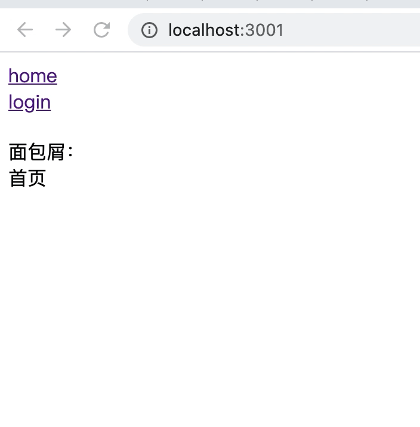

# react 实现动态面包屑导航

## 1、背景

最近在项目中发现，路由页面的面包屑导航通过手动的方式写的，代码如下：

```js
<Breadcrumb>
  <Breadcrumb.Item>资源位管理</Breadcrumb.Item>
  <Breadcrumb.Item>已配置素材</Breadcrumb.Item>
</Breadcrumb>
```
这样在每个路由页面中都会有类似的代码，并且管理起来也不太方便，比如要把导航菜单的名换一下，那么对应页面的面包屑名称也需要手动修改。所以考虑使用基于路由配置的方式来自动生成面包屑导航。

## 2、项目搭建

项目的基本结构使用的是之前搭建的[ssr](../ssr/README.md)的架子，这里需要使用到路由配置表，所以需要使用到[react-router-config](https://github.com/ReactTraining/react-router/tree/master/packages/react-router-config)这个库

<!-- todo 地址待定 -->
项目地址在这查看[react-breadcrumbs](https://github.com/MinjieChang/react-ssr)

最终效果图如下：



## 3、路由配置

先要给每个路由配置项添加breadcrumb属性，表示对应的面包屑名称：

```js
export const routes = [
  {
    breadcrumb: '首页',  // 新增
    path: "/",
    component: Root,
    routes: [
      {
        breadcrumb: 'home',
        path: "/home",
        exact: true,
        component: Home,
        loadData: Home.loadData,
      },
      {
        breadcrumb: 'login',
        path: "/login",
        component: Login,
        routes: [
          {
            breadcrumb: 'page',
            path: "/login/page",
            component: Page,
            exact: true,
          },
          {
            breadcrumb: 'page2',
            path: "/login/pageTwo",
            component: PageTwo,
            exact: true,
          }
        ]
      }
    ]
  }
];
```

下面要做的工作是，对于页面上的路径，我们要需要展示出对应的面包屑，比如对于 `/login/page`, 需要展示出 **首页 / login / page** 这组面包屑。所有我们需要对此路径做下处理，思路其实很简单，我们可以把这个路径拆解成三个部分：

- /login/page
- /login
- /

然后对这三个部分分别在路由表中进行对照，由此可找到他们在路由表中对应的不同的`breadcrumb`的名称，最后再将这些名称组织起来，渲染成我们最终想要的结果。

### 3.1 数组打平

首先把`routes`打平，方便路径的匹配，新建 utils/index.js，添加如下：

```js
export const flattenRoutes = arr =>
  arr.reduce(function(prev, item) {
    prev.push(item);
    return prev.concat(
      Array.isArray(item.routes) ? flattenRoutes(item.routes) : []
    );
  }, []);
```
如此传入routes得到的结果是：

```js
[
  {path: "/", ...},
  {path: "/home", ...},
  {path: "/login", ...},
  {path: "/login/page", ...},
  {path: "/login/page", ...},
]
```
然后，再把当前页面的路径进行拆分，和打平的数组比对，匹配到所有的结果：

```js
export const getBreadcrumbs = ({ flattenRoutes, location }) => {
  // 初始化匹配数组match
  let matches = [];
  location.pathname
    // 取得路径名，然后将路径分割成每一路由部分.
    .split('?')[0]
    .split('/')
    // 对每一部分执行一次调用`getBreadcrumb()`的reduce.
    .reduce((prev, curSection) => {
      // 将最后一个路由部分与当前部分合并，比如当路径为 `/x/xx/xxx` 时，pathSection分别检查 `/x` `/x/xx` `/x/xx/xxx` 的匹配，并分别生成面包屑
      const pathSection = `${prev}/${curSection}`;
      // 对于 拆分的路径，从 flattenRoutes 中查找对应的路由
      const breadcrumb = getBreadcrumb({ flattenRoutes, curSection, pathSection });

      // 将面包屑导入到matches数组中
      matches.push(breadcrumb);

      // 传递给下一次reduce的路径部分
      return pathSection;
    });
    return matches;
};
```

getBreadcrumb函数的作用是找到路径每个片段对应的route对象，代码如下：

```js
const getBreadcrumb = ({ flattenRoutes, curSection, pathSection }) => {
  const matchRoute = flattenRoutes.find(ele => {
    const { breadcrumb, path } = ele;
    if (!breadcrumb || !path) {
      throw new Error('Router中的每一个route必须包含 `path` 以及 `breadcrumb` 属性');
    }
    /**
     * matchPath方法由 react-router-dom提供，实际上也可以使用如下方式替代
     * return pathSection === path
     */
    return matchPath(pathSection, { path, exact: true });
  });
  // 返回breadcrumb的值，没有就返回原匹配子路径名
  if (matchRoute) {
    return render({
      content: matchRoute.breadcrumb || curSection,
      path: matchRoute.path,
    });
  }
  /**
   * 对于routes表中不存在的路径
   * 根目录默认名称为首页.
   */
  return render({
    content: pathSection === '/' ? '首页' : curSection,
    path: pathSection,
  });
```

render 函数要做的事情是对于得到的每个breadcrumb名称渲染成一个组建，比如对于得到的 `login`这个名称使用组件进行渲染，并且把 `path` 作为props传入此组件：

```js
const render = ({ content, path }) => {
  const componentProps = { path };
  if (typeof content === 'function') {
    return <content {...componentProps} />;
  }
  return <span {...componentProps}>{content}</span>;
};
```

到这里，我们通过调用 `getBreadcrumbs` 这个函数可以得到一个装有多个组件的数组，也就是可以完整展现当前路径的面包屑的数组，getBreadcrumbs方法需要接受location对象，那么我们应当在哪里调用这个方法？

比较好的方法是，我们可以在页面的根组件部分来调用此方法，在根组建内来渲染面包屑，就不需要再各个页面组件中再重复写面包屑的渲染逻辑了，一劳永逸。

```js
const Root = ({ route, ...rest }) => {
  const { location } = rest // react-router-config 会在页面组件中注入 location
  let breadcrumbs = getBreadcrumbs({flattenRoutes: flattenRoutes(routes), location})
  return (
    <div>
      <div><Link to="/home">home</Link></div>
      <div><Link to="/login">login</Link></div>
      <div style={{margin: '20px 0'}}>
        <div>面包屑：</div>
        <BreadCrumbs breadcrumbs={breadcrumbs}></BreadCrumbs>
      </div>
      {renderRoutes(route.routes)}
    </div>
  )
};
```

最后，我们将得到的装有面包屑各个部分小组件的数组传入到 `breadcrumbs` 组件中，最后再统一渲染出来：

```js
const BreadcrumbsComponent = ({ breadcrumbs, location: { pathname } }) => (
  <div>
    {breadcrumbs.map((breadcrumb, index) => (
      <span key={breadcrumb.props.path}>
        <Link to={breadcrumb.props.path}>{breadcrumb}</Link>
        {index < breadcrumbs.length - 1 && <i> / </i>}
      </span>
    ))}
  </div>
);
```

至此，整个渲染面包屑的工作基本完成。下面再对几个小问题做优化

### 3.2 添加首页

当前显示的面包屑还存在一个问题是，对于非首页(/)的路径，只显示了子路径的部分，没有显示根路径的部分


这是由于在 `getBreadcrumbs`中的 `reduce` 方法中，对于 `/login/page` 这个路径，只能遍历到 `/login` 和 `/login/page` 这两个路径，所以在 `getBreadcrumbs` 方法的最后需要添加如下判断：

```js
if(location.pathname === '/') {
  return matches;
} else {
  let home = getBreadcrumb({flattenRoutes, curSection: '/', pathSection: '/'})
  return [home, ...matches]
}
```

如果根路径不是 `/`，此时需要额外创建一个首页的面包屑，然后插入到之前的结果前再返回。

### 3.3 面包屑链接优化

注意到，在显示的面包屑中，都是加上了跳转链接的，实际上对于当前的 `active` 路径是不需要添加跳转的，所以需要改造下 `BreadcrumbsComponent` 这个组件：

修改 `Root`，传入 `location`：

```js
<BreadCrumbs breadcrumbs={breadcrumbs} location={location}></BreadCrumbs>
```

在 `BreadcrumbsComponent`判断路由是否和面包屑的路径一致：

```js
const BreadcrumbsComponent = ({ breadcrumbs, location: { pathname } }) => (
  <div>
    {breadcrumbs.map((breadcrumb, index) => (
      <span key={breadcrumb.props.path}>
        {pathname === breadcrumb.props.path ? (
          <span>{breadcrumb}</span>
        ) : (
          <Link to={breadcrumb.props.path}>{breadcrumb}</Link>
        )}
        {index < breadcrumbs.length - 1 && <i> / </i>}
      </span>
    ))}
  </div>
);
```

## 总结

实现一个动态的面包屑的功能，过程不算复杂，涉及到的细节还是比较多的。记录记录还是会有一点收获的吧。

这里实现的方式是在根组件下渲染面包屑，如果有在页面中有自定义配置的需求，可以在 `routes` 数组中添加额外配置，但是这样会使`routes`变的臃肿，不太优雅。或者基于 `BreadcrumbsComponent` 封装一个高阶组件，在需要用到的页面中使用，根据需要再拓展吧。

refer:

[利用 React 高阶组件实现一个面包屑导航](https://juejin.cn/post/6847902215827374094)

[使用 React 打造动态面包屑](https://pjchender.blogspot.com/2018/11/react-react-router-dynamic-breadcrumb.html)

[react-router 原理之路径匹配](https://juejin.cn/post/6844903609411305479)