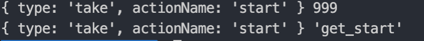
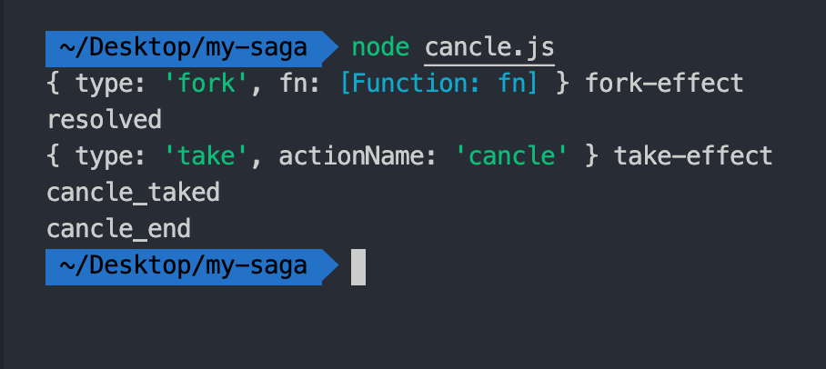
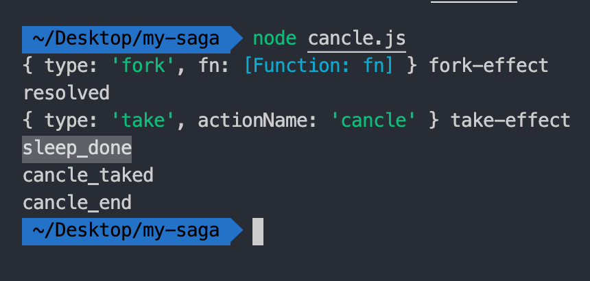

# redux-saga 浅析

本文目录
- [redux-saga 浅析](#redux-saga-浅析)
  - [前言](#前言)
  - [saga概念](#saga概念)
  - [effect](#effect)
    - [take](#take)
    - [模拟take实现](#模拟take实现)
    - [takeEvery实现](#takeevery实现)
    - [effect的本质](#effect的本质)
    - [fork与call](#fork与call)
    - [cancle](#cancle)
    - [put](#put)
  - [总结](#总结)

## 前言

redux提供了一套中间件的方式用以对action的处理，我们常用的中间件一般有[redux-thunk](https://github.com/reduxjs/redux-thunk)(下文以thunk代指)，这个库我们比较熟悉了，主要用于对函数类型的action的处理。除了redux-thunk，常用的中间件还有redux-saga(下文以saga代指)，redux-saga提供了很丰富的api，让我们比较容易的处理一些异步操作。saga的使用可以参考[saga的自述](https://redux-saga-in-chinese.js.org/)，在本篇文章中，我们主要探究saga的实现方式。

## saga概念

saga这一概念来源于后端事物，一个事物通常会包含多个子事物，这几个子事物组合在一起，就称作一个saga。比如用户购买火车票这个事物，它包含了用户订票、付款、退票、出票这几个动作。

在redux-saga中，一个generator函数定义为一个saga函数，在此generator函数中会包含对一个异步事务的完整处理流程。

## effect

effect在saga中是个很常见的概念，任务的发起都是通过effect来实现，在下文的叙述中会对这个概念有进一步的认识

### take

让我们先从saga提供的一个简单的api开始吧。take是saga提供的一个监听acton的api，它的基本用法如下：

```js
import { sagaMiddleware, take } from "redux-saga";

function *mainSaga() {
  yield take('action_name')
  console.log('监听到了action');
}

sagaMiddleware.run(mainSaga)
```

一个基本的结构还是很简单的，从这个示例中，我们可以发现几个特点：

- saga函数使用generator表示，这也是它处理异步任务的方式
- 在saga函数中，take会监听action，直到监听到了预期的action_name，才会继续向下执行，否则会一直阻塞着
- 初始条件下，需要执行`sagaMiddleware.run(mainSaga)`，执行的作用，大致可以猜想一下，可能是进行某种注册操作，否则take如何来监听呢？

总结一下，saga在初始情况下会进行注册操作，然后在saga函数中使用take进行监听。这个流程似乎有点发布订阅的模式的身影，那我们就顺着这个思路来模拟实现一下take函数

### 模拟take实现

这里我们主要是模拟实现sagaMiddleware.run和take这两个函数。实现之前我们先了解下两个概念：

- task：task在saga中表示generator函数的执行环境
- effect：effect在saga中是比较重要的概念，saga中提供的诸多方法可以称为effect，这里的take就是一种effect类型

先实现一个task：

```js
function *mainSaga() { 
  let resule = yield take('start')
  console.log(resule, 'get_start')
}

function take(name) {
  return {
    type: 'take',
    actionName: name,
  }
}

function runTakeEffect(effect, next) {
  // 交出next的执行权，由用户决定什么时候再执行
  // 所以此时需要把 next存储起来，供用户触发
}

function task(gen) {
  const g = gen()
  function next(args) { 
    const result = g.next(args)
    const effect = result.value
    if (!result.done) {
      if (effect.type === 'take') { 
        runTakeEffect(effect, next)
      }
    }
  }
  next()
}
task(mainSaga)
```

下面分析一下task函数的执行过程：

- 把mainSaga作为参数传入到task函数中，执行mainSaga函数得到一个迭代器g，
- 然后在task中定义了一next函数，这个next函数中执行g.next方法，执行g.next()实际上是执行到了 yield take()这里，并且g.next()会返回一个结果result
- result包含done和result两个属性，然后首先判断done属性，如果done属性为false，表明迭代器还未执行完毕；再判断value属性的值，注意，value属性的值是执行take返回的值。take函数实际就是一个返回纯对象的函数，这个对象包含一个type属性，表明这个task的类别
- 判断effect的type值，如果type的值是take，就执行runTakeEffect函数，并且把effect和next作为参数传入

接下来的主要工作是实现runTakeEffect，这个函数的作用主要有两个：

- 转让迭代器的控制权，也就是需要把迭代器使用变量保存起来
- 等待用户触发了特定的事件后再执行迭代器

由于这里需要对迭代器做存储，所以这里还需要引入saga中的另外一个概念：

- channel：channel主要用于做事件的存储和触发，这一点和发布订阅模式中事件调度中心很类似

runTakeEffect的实现：

```js
function channle() { 
  let taker = null
  function take(cb) { 
    taker = cb
  }
  function put(action) {
    if (taker) {
      // 每一个take函数被触发后都将被销毁，
      let tempTaker = taker
      taker = null
      tempTaker(action)
    }
  }
  return {
    take,
    put
  }
}

const chan = channle()

function runTakeEffect(effect, next) {
  // 交出next的执行权，由用户决定什么时候再执行
  // 所以此时需要把 next存储起来，供用户触发
  const { type, actionName } = effect
  // 这里的action是用户出发的aciton的名称
  chan.take((action) => { 
    if (action === actionName) {
      next(effect)
    }
  })
}
```

解析一下runTakeEffect的逻辑：

- channel提供了两个函数，一个是take，用来存储监听的回调函数；一个是put，用来触发监听事件的回调函数，需要注意的是，take的put函数在执行完毕回调函数后会立即将其销毁。所以take的监听有效性只有一次，被触发后就不会再监听了。
- 在runTakeEffect会触发channel的take，存储一个函数，此函数中会对用户触发的action和监听的aciton进行对比，如果一致才会出发next函数，进入gen迭代器的下一个迭代环节，并且把effect作为参数传入，作为take的返回值

现在一个大体的take函数基本实现完毕了，我们来模拟用户的操作事件来测试一下：

```js
setTimeout(() => {
  chan.put('start')
  chan.put('start')
}, 1500)
```
执行结果如下：



我们触发了两次`chan.put`， 但实际上监听函数只执行了一次，这是由于在第一次执行完后就被销毁了。

### takeEvery实现

saga提供了一个takeEvery的api，作为对take的补充，不同于take监听的一次性有效，它对于action的监听是始终有效的，它的基本使用方法如下：

```js
function mainSaga(params) {
  takeEvery('action_name', function cb(params) {
    // do something
  })
}
```
可以看到，takeEvery有两个参数，第一个参数是监听的action，第二个参数是监听的执行函数

实际上，在实现takeEvery之前，我们可以使用一个无限循环的take来模拟下takeEvery，达到无限监听的目的：

```js
function* mainSaga() {
  while (true) { 
    let result = yield take('start')
    console.log(result, 'get_start')
  }
}
```

原理很简单，就是使用一个死循环来实现，当上一个taker执行完并被销毁后，此时会再次进入下次迭代循环：

```js
chan.take((action) => { 
  if (action === actionName) {
    next(effect)
  }
})
```
再次执行next，又到`yield take('start')`这句，再次想chan中添加监听方法，重复之前的过程，达到持续监听的目的。

了解了takeEvery要做到的事情，接下来就模拟实现一下。在这之前，还需要再了解一下saga提供的另外一个api：

- fork：fork的作用是启动一个新的task，不阻塞原有的task。这有别于take，take是阻塞执行的。同样，fork也是一种effect类型，因此很容易就能想到，它返回的也是一个纯对象

```js
function fork(cb) {
  return {
    type: 'fork',
    fn: cb
  }
}

function *takeEvery(action, cb) {
  // fork 的目的是重启一个task，是不是和我们上面的模拟实现takeEvery很类似
  const result = yield fork(function *(params) {
    while (true) {
      let result = yield take(action)
      cb(result)
    }
  })
}

function *mainSaga() {
  yield takeEvery('start', function (effect) {
    console.log(effect, 'takeEvery_start');
  })
}
task(mainSaga)
```
接下来就是要重点实现task的部分：

```js
function runForkEffect(effect, next) {
  // 此时effect可能是个iterator也可能是个纯对象
  // 初次启动 task(mainSaga2)，会返回一个iterator，所以此时的effect是个iterator
  // 如果effect是个iterator，那么就重启一个task，把iterator放入task中执行一遍
  // 重启的task和之前的task互不影响，
  task(effect.fn || effect)
  next(effect)
}

function task(gen) {
  // 需要判断gen是否为函数
  const g = typeof gen === 'function' ?  gen() : gen
  function next(args) {
    const result = g.next(args)
    const effect = result.value
    // 判断当前的effect是否是个iterator，如果是iterator，那么会放入到runForkEffect中重启一个task
    if (effect && typeof effect[Symbol.iterator] === 'function') { 
      runForkEffect(effect, next)
    }
    // console.log(effect.type, 'effect.type')
    if (!result.done) {
      if (effect.type === 'take') {
        runTakeEffect(effect, next)
      } else if (effect.type === 'fork') {
        runForkEffect(effect, next)
      } else { 
        // todo
      }
    }
  }
  next()
}
```

修改后的task还是比较绕的，我们来分析一下它的执行过程：

- 首次执行`task(mainSaga)`，进入task函数，此时mainSaga类型为函数，然后执行mainSaga()，此时返回一个迭代器g，然后再执行next，在next中执行`g.next(args)，这里就比较关键了，此时来到`yield takeEvery()`，由于takeEvery也是个genarator函数，所以takeEvery会返回一个iterator，意味着`const effect = result.value`中的effect是个iterator，符合这句条件判断`effect && typeof effect[Symbol.iterator] === 'function'`，函数进入到`runForkEffect`
- 来到runForkEffect，执行`task(effect.fn || effect)`，由于effect是个iterator，其effect.fn为undefined，这句相当于`task(effect)`，于是再次来到了task函数
- 这次task的参数gen是个迭代器，所以g就是gen，然后再次执行next来到`const result = g.next(args)`，注意，此时是**takeEvery返回的迭代器执行了next**，所以此时就来到了`yield fork()`这句，此时`const effect = result.value`语句返回的effect就是fork函数返回的纯对象了`{type: 'fork', fn: cb}`，然后顺其自然的，函数执行到`runForkEffect(effect, next)`
- 再次来到了runForkEffect，此时的参数effect就是一个对象了，会把effect的fn属性作为参数传人task，再次开启一个任务，此时的fn就是fork方法中的参数
- 然后再次来到了task，一路执行函数最终会来到runTakeEffect这句，剩下的事情就是执行runTakeEffect，其执行过程和我们之前的分析一致了。

最后，加入如下测试方法，会发现每次执行chan.put都实现了监听：

```js
setTimeout(() => {
  chan.put('start')
  chan.put('start')
  chan.put('start')
  chan.put('start')
}, 1500)
```

至此，就实现了takeEvery方法，现在小总结一下：

- takeEvery借助了一个fork方法，fork的作用在于开启一个新的task。实际上，也可以在takeEvery函数中不用fork，直接使用while循环也可，但是在这个例子中通过进一步的抽象提取出了fork这个方法，所以这个思想还是很值得学习的。
- 重新改进了一下task方法，兼容了参数是iterator和generator的两种情况，这个方法比较难理解的点在于初始化的时候调用runForkEffect的情况。

### effect的本质

到此，对effect有一些认识了，这里对effect总结一下，先看一下官方的解释：

> An effect is a plain JavaScript Object containing some instructions to be executed by the saga middleware.

意思是，effect是个纯对象，包含一些指令信息，这些指令会被middleware解释执行。

通过上面的两个例子，我们已经认识到了两个effect，一个是take，一个是frok，他们实际上都是一个对象，相当于给执行器task发送指令，task通过判断effect的不同类型知道要处理什么样的任务。这就是task的本质。

所以基于这种通过effect给task发送指令的做法，我们再来模拟实现如call、cancle等api，实际上，saga中提供的effects中的api也是这么做的。

### fork与call

在上面实现takeEvery的过程中，我们实现了一个辅助函数fork，fork的作用是启动一个新的task实现无阻塞调用。与之相对的是另外一个effect叫call，call的作用的也是调用有副作用的函数，它是阻塞调用的。它的基本用法如下：

```js
// 首先定义一个异步方法
function sleep(time = 1000) {
  return new Promise((resolve, reject) => {
    setTimeout(() => {
      resolve('hello saga')
    }, time)
  })
}

// 使用call调用
function *sagaByCall(params) {
  yield call(delay, 2000)
  console.log('call_end'); // 这里会等待2秒，才打印出call_end
}
```
如上所述，调用`yield call`后，函数将被阻塞住，2秒过后才会继续向下执行到`console`语句

它的实现也是比较简单的，我们需要判断一下，call调用的函数返回的结果，如果是promise，就等其结果resolve后再继续执行迭代器的next方法，如果不是promise，就直接调用next方法继续迭代器的执行。

首先实现一下call，和fork类似，它也是返回描述effect的纯对象的函数：

```js
function call(fn, arg) {
  return {
    type: 'call',
    fn: () => fn(arg)
  }
}
```

然后再改造一下task函数，需要变动的地方就是在判断effect的类型的条件中增加一项：

```js {10-12}
function task(gen) {
  // ...
  function next(args) {
    // ...
    if (!result.done) {
      if (effect.type === 'take') {
        runTakeEffect(effect, next)
      } else if (effect.type === 'fork') {
        runForkEffect(effect, next)
      } else if (effect.type === 'call') { // 这里增加一项effct的type属性是call的判断
        runCallEffect(effect, next)
      }
    }
  }
  // ...
}
```
最后再实现runCallEffect函数：

```js
function runCallEffect(effect, next) {
  let result = effect.fn()
  // 如果result类型是promise，调用resolvePromise，就是等待promise状态置为resolve后再执行迭代器的next方法
  // 从而实现阻塞的效果
  if (isPromise(result)) { 
    resolvePromise(result, next)
    return
  }
  next(result)
}

function isPromise(result) { 
  return result && typeof result.then === 'function';
}

function resolvePromise(result,next) { 
  return result.then(next, error => next(error))
}
```
到此，一个基本的call方法就完成了。

需要提醒的是，此处我们使用了call直接调用了delay方法 `call(delay)`，这是没有问题的，但是我们自己在上文中实现的fork却不能直接这么调用，这是由于fork是重启了一个task，而task的参数我们设定的只能是iterator和generator函数，因此fork的参数不能是一个基本的函数，所以在我们的fork版本中，需要这么来调用：

```js
// 使用call调用
function *sagaByFork(params) {
  yield fork(function* (arg) {
    yield sleep(arg)
  }, 10);
  console.log('fork_end');
}
```
这里我们传递给fork的是一个generator函数，在此方法中再调用delay方法。

实际上，在saga的使用中，我们传给fork的函数不必是一个generator函数，可以是一个普通的函数，这是由于saga在runForkEffect函数中做了兼容处理，它会判断函数参数的返回值是否为一个iterator，如果不是则转化为一个iterator，这里我们为了方便描述，未做此兼容。saga做的兼容代码如下：

```js
function runForkEffect(effect, next) {
  let result = effect.fn()
  if (is.iterator(result)) {
    return result
  }
  // 否则模拟出一个迭代器
  let iterator = makeIterator()
  return iterator
}

function makeIterator() {
  let resolved = false
  const next = arg => {
    if (!resolved) {
      resolved = true
      // Only promises returned from fork will be interpreted. See #1573
      return { value: result, done: !is.promise(result) }
    } else {
      return { value: arg, done: true }
    }
  }
  // 这里的throw 和 return省略掉
  let iterator = { next: next, throw: '', return: '' }
  iterator[Symbol.iterator] = () => iterator
  return iterator
}
```
以上是对call和fork的使用简单的对比，并且基本能了解到阻塞与非阻塞调用的实现的原理。

在使用场景上，fork的非阻塞特性更适用于后台不影响主流程的代码(比如后台打点/开启监听等)，这往往是加快页面渲染的一种方式。而call更适用于需要立即获取结果的异步调用，将异步的回调转为同步的写法，这就和`async、await`很类似了，关于`generator与async、await的联系`可以参考我之前的这篇[文章](../../js/async)。

### cancle

saga还提供了一个很有的用的effect类型即cancel，它可以取消正在运行中的task，saga在取消task后还做了两个工作，一个是取消saga中还未完成的逻辑，另一个是可以执行[清理操作](https://redux-saga-in-chinese.js.org/docs/advanced/NonBlockingCalls.html)，以保持前后状态的一致性，比如异步操作中的loading状态。

先看一下它是如何使用的吧：

```js
function* authorize(user, password) {
  try {
    // 处理登陆成功的逻辑
    const token = yield call(Api.authorize, user, password)
    yield put({type: 'LOGIN_SUCCESS', token})
    return token
  } catch(error) {
    // 处理登陆失败的逻辑
    yield put({type: 'LOGIN_ERROR', error})
  } finally {
    // 处理请求被取消的逻辑
    if (yield cancelled()) {
      // ... put special cancellation handling code here
    }
  }
}
function* loginFlow() {
  const task = yield fork(authorize, user, password)
  const action = yield take(['LOGOUT', 'LOGIN_ERROR'])
  if(action.type === 'LOGOUT') {
    yield cancel(task)
  }
  yield call(Api.clearItem('token'))
}
```
这是官网提供的一个例子，在这个saga中实现的功能是，fork一个登陆的方法authorize，同时监听用户的剩余操作，正常情况下，登陆流程走完会执行try中的语句，如果登陆出现异常会执行catch语句，这两个流程属于正常流程。

如果在登陆的过程中，用户发起了取消操作，saga检测到发起的action的type是LOGOUT，此时就取消掉fork发起的task，authorize进入到finally语句，并通过`yield cancelled()`判断是否是取消操作，此时再做取消操作的特殊处理

取消任务的操作实际上使用的场景并不是很多，主要是给用户撤销或是反悔的操作，弥补用户的误操作。下面简析一下实现原理

如官网所述，**若要取消正在运行的任务，middleware 将调用底层 Generator 对象上的 return。这将取消任务中的当前 Effect，并跳转至 finally 区块（若有定义的话）**。

先设定一下我们要达到的目的：

```js
function *mainSaga() {
  let forkTask = yield fork(function* (arg) {
    yield sleep(arg)
    console.log('sleep_done')
  }, 2000);
  console.log('resolved')
  yield take('cancle')
  console.log('cancle_taked')
  // 取消task
  yield cancle(forkTask)
  console.log('cancle_end')
}
task(mainSaga)
setTimeout(() => {
  chan.put('cancle')
}, 1000)
```
在这个例子中，先使用fork来发起一个task，在这个task中2秒后会打印出sleep_done，然后监听了用户发起的action，如果action是cancle，就执行cancle取消掉task，最终打印出cancle_end。

然后在调用中，我们在1秒后发起了cancel的action，此时由于fork的task还未完成，所以将被取消掉，task中的consle语句将不被执行到。

接下来的任务就是修改task方法和创建一个cancel方法。首先cancle仍然是effect类型：

```js
function cancle(taskId) { 
  return {
    type: 'cancle',
    taskId: taskId
  }
}
```
然后再改造task方法，主要是增加了两个地方：

```js
function task(gen) {
  const g = typeof gen === 'function' ? gen() : gen
  // 判断 gen 是函数类型，保存对迭代器对象的引用
  if (typeof gen === 'function') { 
    gen.g = g
  }
  //....
  if (!result.done) {
    // ...
    } else if (effect.type === 'cancle') {
      console.log(effect, 'cancle-effect')
      runCancleEffect(effect, next)
    }
  }
}
```
再添加runCancleEffect方法：
```js
function runCancleEffect(effect, next) {
  const { taskId: { fn: { g } } } = effect
  g.return()
  next()
}
```
在runCancleEffect中的操作很简单，就是执行了迭代器的return方法，终止迭代器的向下执行。

测试后，执行的结果符合我们的预期。


现在修改下测试例子，在3秒后再执行`chan.put('cancel')`:

```js
setTimeout(() => { 
  chan.put('cancle')
}, 3000)
```
期望的结果是，由于此时fork的task已经执行完毕，所以cancel并不能起到效果。sleep_done会被正常打印出来。


### put

put的作用就是纯粹的发起一个acton到store中，功能和dispatch一致。我们已经得出了实现一个effect的一般方法了，这里对于put的实现就不再展开了。当然实现put需要和redux联系起来，毕竟还需要引用其dispatch。

## 总结

通过上面的实践，我们大致能了解到saga的工作原理，实现的还比较的粗浅，很多场景也未考虑到，本文的主要目的是对于saga的工作原理有个认识。saga中还提供了很多强大的功能及对异常的捕获处理，这里未涉及到。

完整代码访问[地址](https://github.com/MinjieChang/simple-redux-saga)

refer：

[浅析redux-saga实现](https://zhuanlan.zhihu.com/p/30098155)<br>
[redux-saga实践总结](https://zhuanlan.zhihu.com/p/23012870)<br>
[构建你自己的 redux-saga](https://www.yuque.com/shinima/blog/qtarrq)<br>