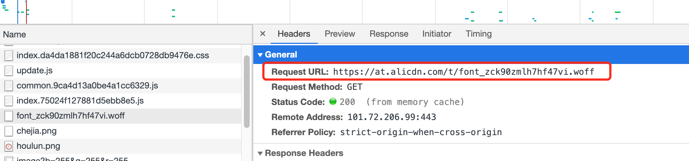

# dora + atool-build 升级到 roadhog

## 背景

公司的一个项目做的时间比较久，用的是基于 `dora+atool-build` 的开发和部署环境，在开发的过程中碰到了如下几个问题，一是热更新有时会不生效，导致修改文件后，需要再手动重启一下本地服务，影响了开发效率。其次是 `dora` 和 `atool-build` 已是比较老的版本，作者现在已停止维护，并且也给出了升级到 `roadhog` 的建议。本文记录升级到 `roadhog` 的步骤及遇到的问题。

## 目标

此次升级的主要目标如下：

1. 将项目的开发和打包环境切换到 `roadhog`，解决当前遇到的热更新不生效的问题
2. 兼容现有的打包方式，打包后的结果跟现在保持一致，包括打包后的js文件和css文件名保持现有的带hash的方式、公共文件的提取、异步加载等方式
3. 兼容现有的数据mock方式，现在mock文件写的比较多，升级后仍要保持现有的mock文件有效

## 步骤

### 基本配置

1、删掉package.json中的 dora 和 atool-build 相关依赖：

```js
{
  // dora
	"dora": "^0.4.3",
  "dora-plugin-proxy": "^0.8.2",
  "dora-plugin-webpack": "^0.8.1",
  "dora-plugin-webpack-hmr": "^0.2.1",
  // atool
  "atool-build": "^0.8.0",
  "atool-test-mocha": "^0.1.5",
}
```

2、安装 roadhog，这里使用版本是0.6.1，后面会提为什么要用这个版本

```shell
npm i -D roadhog@0.6.1
```

3、修改脚本

```shell
{
	scripts: {
  	"start": "roadhog server",
    "roadhog-build": "roadhog build",
  }
}
```

4、新增 .roadhogrc 配置文件

```js
{
  "entry": "src/index.js",
  "disableCSSModules": true,
  "less": true,
  "publicPath": "/",
  "outputPath": "build",
  "autoprefixer": null,
  "proxy": null,
  "devtool": "eval",
  "extraBabelPlugins": [
    "transform-runtime",
    "transform-decorators-legacy",
    ["import", { "libraryName": "antd", "style": "css" }]
  ],
  "env": {
    "development": {
      "extraBabelPlugins": [
        "dva-hmr"
      ]
    }
  }
}
```

这一步可参考文档：

- [从atool-build + dora到roadhog](https://github.com/sorrycc/blog/issues/17)
- [新增.roadhogrc](https://github.com/dvajs/dva-cli/commit/203f2ffdd91a06f0b1538899e7509edc7ba2764e)

然后安装这几个依赖：

```shell
# 开发依赖
npm i babel-plugin-transform-runtime@6.23.0 babel-plugin-import@1.13.3 babel-plugin-dva-hmr@0.4.0 babel-plugin-transform-decorators-legacy@1.3.5 --save-dev
# 生产依赖
npm i babel-runtime@6.26.0 --save
```

插件解析：

- babel-plugin-transform-runtime：编译阶段代码转换，转译语法和api。[babel-plugin-transform-runtime作用](https://zhuanlan.zhihu.com/p/147083132)
- babel-plugin-import：antd 组件按需引入
- babel-plugin-transform-decorators-legacy: 支持装饰器写法
- babel-runtime：babel-plugin-transform-runtime转译过程中需要使用一些辅助函数，babel-runtime就是提供这些helper函数。运行阶段引入的对相关api(includs)或新语法(class、promise、generator等)的转换。[babel-runtime作用](https://juejin.cn/post/6844903615212027917)

5、新建public/index.html 文件夹，把src/index.ejs 内容复制过来，同时需要在index.html中添加如下内容：

```js
<script src="index.js"></script>
```

这是由于.roadhog默认会打包出index.js文件，所以需要在html文件中手动引入(后面会使用webpack-html-plugin自动将打包的文件插入到html文件中，不需要手动引入)。

6、使用less

项目中使用了less变量配置了自定义主题，覆盖了antd的默认主题，所以需要在.roadhog做下需改：

1. 把 disableCSSModules 设置为true，关闭cssModules
2. style属性设置为true，加载antd的less样式

```js
{
  "disableCSSModules": true // 关闭cssModules，否则全局样式不生效
  "extraBabelPlugins": [
    "transform-runtime",
    ["import", { "libraryName": "antd", "style": "true" }] // true 表示使用antd的less文件，这样自定义主题才生效
  ],
}
```

参考： [自定义主题](https://github.com/dvajs/dva-example-user-dashboard/commit/d6da33b3a6e18eb7f003752a4b00b5a660747c31)

7、修改字体引入

去掉 theme.less 文件中的 `@icon-url : "/src/static/fonts/ux/iconfont"` 变量覆盖，由于升级后导致antd中的一些小字体无法显示(比如menu的箭头)

删除后，字体加载的是aliyun地址的字体：


项目中使用的antd的版本是 `2.x.x`，字体需要从 `aliyun` 上下载，但是在 `3.x.x`版本中不存在这个问题，也就是字体直接打包到了antd中

但是如果您觉得从aliyun上下载字体不方向，必须得从本地加载，实际上也是可以配置的：

1. 注释掉 theme.less 的这行代码；

2. 是把 src/static/fonts 文件 存放到 public文件夹中

3. 修改.roadhogrc，添加如下内容：

```js
"theme": {
  "@icon-url": "'/fonts/ux/iconfont'"
},
```

需要注意的是，双引号中一定要有单引号覆盖 `@icon-url` 变量，参考[fix icon in package theme](https://github.com/devisions/dvajs-user-dashboard/pull/2)

8、安装less插件

```shell
npm i -D less-loader@2.2.3 less@2.7.3
```

但是呢坑总是无处不在的，如果安装less的最新的3.x.x版本，启动项目可能会遇到这个问题：`src/index.less中 无法识别 '~antd/dist/antd.less'`

此时需要把less-loader版本降低，安装 less@2.7.3 这个版本

参考：[解决 dva @import "./themes/default"; 无法读取问题](https://github.com/ant-design/ant-motion/issues/44)

9、修改webapck配置文件名

roadhog默认会读取项目中的webpack.config.js配置文件，此时我们暂时不用到webpack配置文件，所以暂时先把配置文件改成webpack.config1.js这个名，先让项目能跑起来。

通过👆的配置，没有意外的话，重新启动一下项目应该能跑起来了：

```shell
npm i
npm run start
```

### 配置mock

1、添加配置文件，新建.roadhogrc.mock.js 文件，并把之前的proxy.mock.js文件复制过来, 然后删除proxy.mock.js文件。在.roadhogrc.mock.js 中添加如下内容：

```js
/**
 * mock 写法可以使用当前这种方式
 * 也可以使用加上请求方式：
 * "POST /api/athena/monthCards/showRule/edit": "./mock/DisplayOrderConfigV2/detail.json",
 * "GET /api/athena/monthCards/showRule/edit": "./mock/DisplayOrderConfigV2/detail.json",
 */
module.exports = require('./tools/mock_data')(proxyPath);
```

2、由于新的mock方法不支持直接填写路径名称，并且需要在mock的url前添加请求方法如GET、POST，所以添加了一个兼容方法，在/tools/mock_data.js中：

```js
let fs = require("fs");
let path = require("path");

module.exports = function (proxyPath) {
  const mock = {};
  Object.keys(proxyPath).forEach((key) => {
    let filePath = proxyPath[key];
    if(typeof filePath !== "string") {
      mock[key] = filePath;
      return;
    }
    let targetPath = path.join(__dirname, "../" + filePath);
    if (fs.existsSync(targetPath)) {
      let result = require(targetPath);
      if(key.indexOf('GET') > -1 || key.indexOf('POST') > -1){
        mock[key] = result;
      } else {
        mock["GET " + key] = result;
        mock["POST " + key] = result;
      }
    } else {
      console.log("mock文件地址" + targetPath + "不存在，请检查");
    }
  });
  return mock;
};
```

### 自定义配置

以上的过程是使用了roadhog的默认打包配置，但是在我们的项目中有一些自定义的配置，比如

- 打包文件名添加hash，roadhog默认打包出的文件没有hash名称
- 公共文件提取，css文件的提取
- 配置插件，自动生成html文件

这些通过配置webpack.config.js文件来实现

#### 配置html-webpack-plugin

1、安装

```shell
npm i -D html-webpack-plugin@2.29.0 html-loader@0.5.5
```

2、在webpack.config.js中添加如下修改：

```js
module.exports = function(webpackConfig){
	...
  // roadhog 默认使用 file-loader 读取html文件，读取的结果为二进制文件
  // 所以需要修改为使用 html-loader 读取
	webpackConfig.module.loaders.forEach(loader => {
    if(loader.test && loader.test.toString().indexOf('html') > -1) {
        loader.loader = 'html'
    }
  })
  
  ...
  webpackConfig.plugins.push(new HtmlWebpackPlugin({
  	...
    	// 注意这里使用的是html文件，需要把index.ejs 改为 index.html。为什么不用ejs文件？
    	// 使用ejs文件会有相关bug
    template: 'src/index.html',
  }))
}
```

配置这个折腾了好一阵，参考[添加html打包插件](https://github.com/sorrycc/roadhog/issues/231)

#### 配置noParser

由于系统引入了jszip.js这个库，在编译时候会有相关warnning，加上下面这行可解决：

```js
webpackConfig.module.noParse = [/jszip.js$/]
```

参考：[jszip warning in console](https://github.com/SheetJS/sheetjs/issues/565)

#### 配置common-chunk-plugin

1、安装

之前的webpack是从atool-build中引入的，把atool-build删除后，需要重新安装一下wepack

```shell
npm i -D webpack@1.14.0
```

```js
+ const webpack = require('webpack')
- const webpack = require('atool-build/lib/webpack')
```

#### 配置开发环境的文件名

此时，开发环境打包出的入口文件名称为index.js，在开发环境下的热更新是可以生效的，但是有个诡异的问题是，修改model中的文件，发现并没有生效，手动刷新也不行，只能重新启动一下，解决这个问题尝试了如下方法：

1、让 `roadhog` 不走 `webpack.config.js` 文件，发现修改 `model` 文件是可以生效的，这说明这跟我们的 `webpack.config.js` 的配置有关

2、猜想这可能跟 `model` 的动态加载有关，尝试添加如下配置可生效：

```js
if (env === 'development') {
  webpackConfig.output.filename = '[name].[hash].js'
}
```

这样打包出的 `index.js` 文件名就会加上hash，每次需改 `model` 后即可生效，不过需要自己手动刷新一下。手动刷新的步骤在不使用webpack.config.js中也是需要的。

#### 生产环境提取css文件

提取css文件需要使用到 `extract-text-webpack-plugin` 这个插件

现在打包出来的js文件都是带上了hash值的，唯有一个css文件是不带hash的，在配置文件中明明有加上提取的css文件名，但是并没有生效：

```js
webpackConfig.plugins.push(new ExtractTextPlugin('[name].[contenthash].css', { allChunks: true }))
```

暂时还不知添加插件的方法不生效的原因，猜测这个可能是 `roadhog` 当前版本的一个问题。

既然覆盖没有效果，只能修改默认的配置了，直接修改默认的配置发现是可行的，添加如下修改：

```js
webpackConfig.plugins[3].filename = '[name].[contenthash].css'
webpackConfig.plugins[3].options = { allChunks: true }
```

[无法加上hash值的原因](https://github.com/sorrycc/roadhog/issues/69)

#### 修改脚本

1、此时，修改对之前的启动、打包、上传脚本做如下修改

```shell
{
  "start": "node bin/start.js && roadhog server",
  "roadhog-build": "roadhog build",
  "build": "roadhog build && npm run stark",
}
```

2、修改start.js

这两个函数不需要了，可以注释了：

```js
//function openBrowser() {
  ...
//}

//function startDora() {
	...
//}
```

3、修改fix_path_new

升级后 不存在index.css文件，这里的fix不需要了

```js
//var htmlFile = dist + '/index.html'
//var htmlFileContent = fs.readFileSync(htmlFile, 'utf-8')
//fs.writeFileSync(htmlFile, (function(text) {
    ....
//})(htmlFileContent), 'utf-8')
```

### 遇到的问题

迁移过程中遇到的一些比较棘手的问题及解决方法：

1、`src/index.less` 中无法识别 `'~antd/dist/antd.less'`

参考[解决 dva @import "./themes/default"; 无法读取问题](https://github.com/ant-design/ant-motion/issues/44)

2、引入的全局样式没生效

`index.js` 中引入的 `import './index.less'` 没有生效

原因是在roadhog中默认开启了 `cssModule` ，在 `.roadhogrc` 中关掉即可

参考[配置全局less](https://blog.csdn.net/Knove/article/details/78742735?utm_medium=distribute.pc_relevant_t0.none-task-blog-searchFromBaidu-1.control&depth_1-utm_source=distribute.pc_relevant_t0.none-task-blog-searchFromBaidu-1.control)

3、 使用 `dva` 高版本带来的问题

1. react-router不兼容问题
2. 和项目中一些依赖版本不兼容，导致开发和打包时出现各种奇怪的问题

## 总结

### 迁移结果

基于以上的配置主要实现了如下几个目标：

1. 修复了热更新不生效的问题，提升开发体验
2. 不改变现有的开发方式，没有破坏性升级，保持原有的开发方式，包括数据mock等。
3. 基本还原了升级前的打包效果，包括打包文件加hash、公共文件提取、异步加载等。

### 收获了什么

之前没有在正式项目中做底层的升级，在这次升级的过程中还是遇到了一些相对棘手的问题，整体难度不大，也得到了一些收获：

1. 整体规划。在升级之前先做充分的调研，确定要修改的内容有哪些。然后再分步骤进行，比如在此次升级过程中，先沿用了roadhog的默认配置，让项目先能跑起来。然后再修改mock、增加自定义的打包配置，最后再修改脚本。
2. 一定要谷歌。过程中肯定会遇到很多奇怪的兼容问题，此时最好的办法是通过goolgle在github或stackoverflow上寻找答案
3. 深入源码。在解决提取css的过程中，添加 `ExtractTextPlugin` 并没有生效，并且尝试了很多办法没有解决，此时只能去看roadhog的源码，看下它里面是如何配置的。然后在源码中通过添加插件的方式可以解决问题，但是在配置文件中添加就无法生效。像这样的迷之bug只能在源码中才能定位问题。
4. babel及相关插件。加深了对babel相关插件的理解，比如 `babel-transform-runtime`、`babel-runtime`等的使用及区别。
5. webpack。通过修改相关配置，webpack的相关模块的配置有更多认识，比如hash、contenthash、chunkhash这些区别，webpack中的module、chunk、bundle这些概念的理解


参考资料

1. manifest
- [manifest](https://www.jianshu.com/p/95752b101582)
- [webpack-manifest](https://www.webpackjs.com/guides/caching/)

2. hash
- [filiname](https://www.cnblogs.com/skychx/p/webpack-filename-chunkFilename.html)
- [hash](https://www.cnblogs.com/skychx/p/webpack-hash-chunkhash-contenthash.html)

3. 插件
- [commonChunksPlugin](https://www.webpackjs.com/plugins/commons-chunk-plugin/)

