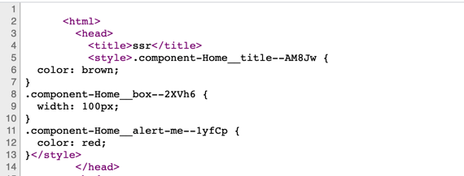

# react ssr 构建

## 前言

之前在写[react性能优化](../optimization)这篇文章中提到了ssr的部分，社区中有一些关于ssr的框架，比如大名鼎鼎的[nextjs](https://github.com/vercel/next.js)，在这篇文章中，我们就一步步来构建一个ssr的项目。

## 起步
我们经常说ssr，那么ssr到底是什么呢？我们先通过一个简单的例子来看。

新建一个项目，并启动一个express服务

```js
const express = require('express');
const app = express()
app.use('/', function(req, res, next){
  res.send(
    `
     <html>
       <head>
         <title>ssr</title>
       </head>
       <body>
         <div id="root">ssr</div>
       </body>
     </html>
    `
    );
})
app.listen(3001, () => {
  console.log('listen on port 3001')
})
```
浏览器打开localhost:3001/，可以看到页面，这就是一个简单的ssr，实际上一些node渲染模版比如ejs、pug等做的也是类似的工作。


所谓的ssr就是在服务端将html字符串拼接好后发送给浏览器，浏览器再解析展示出来的过程

与ssr对应的是客户端渲染(csr)，那么客户端是什么样的，它与ssr有什么区别？用react脚手架create-react-app生成一个项目，run起来，打开控制台看看有什么：


我们发现就只有一个id为root的节点，除此之外没有别的节点元素，那么页面中显示的这些元素都是从哪来的？其实就是下面的script标签中引入的js代码执行后加载出来的。

所以这俩个的区别就是，一个的页面解析过程在服务端完成，一个解析过程在浏览器端完成。

通过一张图了解一下：


那既然csr已经可以实现页面的渲染了，为什么还要ssr呢，何必还要多此一举？其实csr还是有其弊端的
- 首屏白屏问题，csr需要浏览器加载js代码，再执行js代码生成html元素，这一加载再执行耗时成本较高，导致首页加载会有短暂的白屏出现
- seo(search enginee optimization 搜索引擎优化)问题，客户端加载的是一些js文件，而大部分的搜索引擎spider只认识html文件内容，对js无感。

那么，ssr的出现就是为解决这些问题的。

## react组件实现ssr

现在我们就基于刚才创建的react项目，把它改造成ssr项目

首先创建component文件夹，在此文件夹下新建两个组件Home.js 和 Page.js

Page.js:
```js
const React = require('react');
const Page = () => {
  return (
    <div>
      <div>This is page</div>
    </div>
  )
}
module.exports = Page;
```

Home.js:
```js
const React = require('react');
const Page = require('./Page')
const Home = (props) => {
  return (
    <div>
      <div>This is home</div>
      <Page></Page>
    </div>
  )
}
```

新建server/app.js文件
```js
const express = require('express');
const React = require('react');
const { renderToString } = require('react-dom/server')
const Home =  require('../component/Home');

require("node-jsx").install()

const app = express()
const content = renderToString(React.createElement(Home));
app.use('/', function(req, res, next){
  res.send(
    `
     <html>
       <head>
         <title>ssr</title>
       </head>
       <body>
         <div id="root">${content}</div>
       </body>
     </html>
    `
    );
})
app.listen(3001, () => {
  console.log('listen on port 3001')
})
```

package.json的scripts下添加如下命令：
```js
  scripts: {
    "ssr": "nodemon server/app.js",
  }
```
> 注意：1、node-jsx这个库为了在服务端支持jsx的语法 2、nodemon方便监听文件变化，重启node应用

打开控制台，可以看到渲染的整个html结构


#### 小总结
- 把react组件生成字符串的关键方法是ract提供的renderToString方法

### 添加事件
现在可以正常渲染一个组件了，但是如果我们在组件上添加监听事件，发现并不会生效：
```js
const Home = () => {
  return (
    <div>
      <div>This is home222</div>
      <button onClick={() => {alert('666')}}>click</button>
      <Page></Page>
    </div>
  )
}
```
button虽然可以显示出来，但是点击不会有任何反应，这是由于renderToString方法并不会处理添加在元素上的任何事件。要想实现事件监听，这就需要**同构**了

所谓**同构**通俗的讲就是同一套代码多端运行，服务端运行一遍，可以端运行一遍，服务端完成html元素的渲染，客户端完成元素事件的绑定。

说白了就是，需要把编译的js的文件返回给客户端，让客户端执行实现事件的绑定，现在需要做的是把我们的react组件编译打包后交给服务端，由服务端决定何时返回。

项目根目录下添加两个文件：webpack.base.js 和 webpack.client.js
webpack.base.js
```js
module.exports = {
  module: {
    rules: [{
      test: /\.js$/,
      loader: 'babel-loader',
      exclude: /node_modules/,
      options: {
        presets: ['@babel/preset-react',  ['@babel/preset-env', {
          targets: {
            browsers: ['last 2 versions']
          }
        }]]
      }
    }]
  }
}
```

使用的bable7，配置.babelrc为：
```js
{
  "presets": [
      "@babel/preset-env",
      "@babel/react"
  ],
  "plugins": [
    ["@babel/plugin-transform-runtime", 
      {
        "absoluteRuntime": false,
        "corejs": false,
        "helpers": true,
        "regenerator": true,
        "useESModules": false,
        "version": "7.0.0-beta.0"
      }
    ]
  ]
}
```

webpack.client.js
```js
const path = require('path');
const merge = require('webpack-merge');
const config = require('./webpack.base');

const clientConfig = {
  mode: 'development',
  entry: './client/index.js',
  output: {
    filename: 'index.js',
    path: path.resolve(__dirname, 'dist')
  },
}

module.exports = merge(config, clientConfig);
```

新建/client/index.js文件
```js
import React from 'react';
import ReactDom from 'react-dom';
import { BrowserRouter } from 'react-router-dom'
import Home from '../component/Home';

const App = () => {
  return (
    <Home></Home>
  )
}
ReactDom.hydrate(<App />, document.getElementById('root'))
```

然后package.json的scripts下添加如下命令
```js
"scripts": {
  "dev:build:client": "webpack --config webpack.client.js --watch"
},
```

server/app.js
```js
// 静态化打包文件夹目录
app.use(express.static('dist'));

// 文件返回的html字符串需要添加：
`
  <script src="/index.js"></script>
`
```
此时再点击按钮，发现事件已经可以添加上了


#### 小总结
在同构过程中，我们使用的方法是ReactDom.hydrate，而不是使用的ReactDom.render，这是由于在服务端渲染过程中，会给根元素加上data-reactroot这个属性，在客户端渲染过程中会使用hydrate方法复用渲染好的结构，然后加上事件即可，详情可见[hydrate](http://react.html.cn/docs/react-dom.html#hydrate)

现在用一张图来表示整个的渲染流程：


### 添加路由

根路径添加router.js

```js
import React from 'react';
import { Route, Link } from 'react-router-dom'
import Home from './component/Home';
import Login from './component/Login'

export default (
  <div>
    <div>
      <Link to="/">home</Link>
    </div>
    <div>
      <Link to="/login">login</Link>
    </div>
    <Route path='/' exact component={Home}></Route>
    <Route path='/login' exact component={Login}></Route>
  </div>
)
```

改造client/index.js
```js
// 添加
import Router from '../router'

const App = () => {
  return (
    <BrowserRouter>
      {Router}
    </BrowserRouter>
  )
}
```
刷新浏览器发现可以正常显示，点击链接也可以正常跳转，但是控制台有个警告提示：


这是因为在router.js中，每个Route组件外面包裹着一层div，但服务端返回的代码中并没有这个div,所以报错。如何去解决这个问题？需要将服务端的路由逻辑执行一遍。

添加server/utils.js
```js
import Routes from '../router'
import { renderToString } from 'react-dom/server';
//重要是要用到StaticRouter
import { StaticRouter } from 'react-router-dom'; 
import React from 'react'

export const render = (req) => {
  //构建服务端的路由
  const content = renderToString(
    <StaticRouter location={req.baseUrl} >
      {Routes}
    </StaticRouter>
  );
  return `
    <html>
      <head>
        <title>ssr</title>
      </head>
      <body>
        <div id="root">${content}</div>
        <script src="/index.js"></script>
      </body>
    </html>
  `
}
```
改造server/app.js
```js
// 删除之前的app.use('/', ...)

// 添加
const { render } = require('./utils');

app.use('*', function(req, res, ctx) {
  res.send(render(req))
})
```
修改package.json的scripts下命令
```js
"scripts": {
  "ssr": "nodemon --exec babel-node server/index.js",
},
```
使用bable-node以解析esmodule的相关语法

把路由切换到/login，刷新页面，查看网页源代码，发现返回的是Login组件的html字符串，这表明服务端已经可以针对特定的理由实现服务端渲染了，当然**这还只是对于一层的理由渲染，对于多层的嵌套路由，后面会介绍到**


#### 小总结
- 服务端的路由使用的是 StaticRouter，因为是在服务端渲染，无需记录当前路由状态，所以是无状态路由
- 需要将当前请求的 baseUrl 作为props传入，当页面刷新的时候需要知道当前请求的是哪个路由，方便服务端生成对应的组件

### 添加redux

创建/store/home/index.js，这个文件也可称为home模块的reducer
```js
import { CHANGE_LIST } from "./constants";
const initState = {
  name: 'mj_chang',
  list: [],
}
export default function(state = initState, action = {}) {
  switch(action.type){
    case CHANGE_LIST:
      return {
        ...state,
        list: action.payload
      }
    default:
      return state
  }
}
```
创建/store/home/constants.js，存放一些常量
```js
export const CHANGE_LIST = 'HOME/CHANGE_LIST';
```
创建/store/home/actions.js
```js
import axios from 'axios';
import { CHANGE_LIST } from "./constants";

//普通action
const changeList = list => ({
  type: CHANGE_LIST,
  payload: list
});

//异步操作的action(采用thunk中间件)
export const getHomeList = () => {
  return (dispatch) => {
    return axios.get('/api/list')
      .then((res) => {
        const list = res.data;
        dispatch(changeList(list.data))
      });
  };
}
```

添加store/index.js，创建store
```js
import {createStore, applyMiddleware, combineReducers} from 'redux';
import thunk from 'redux-thunk';
import homeReducer from './home';
//合并项目组件中store的reducer
const reducer = combineReducers({
  home: homeReducer
})

//导出创建的store
// 导出函数的目的是，在服务端渲染时，保证每个用户请求得到是不同的store
export default () => {
  return createStore(reducer, applyMiddleware(thunk))
}
```

再改造client/index.js组件
```js
// 引入store
import getStore from '../store'

const App = () => {
  return (
    <Provider store={getStore()}>
      <BrowserRouter>
        {Router}
      </BrowserRouter>
    </Provider>
  )
}
ReactDom.hydrate(<App />, document.getElementById('root'))
```

再改造Home.js组件
```js
import { connect } from 'react-redux';
import { getHomeList } from '../store/home/actions'
import React, { useEffect } from "react";
import Page from './Page';

class Home extends React.Component{
  componentDidMount(){
    this.props.getHomeList()
  }
  render(){
    const props = this.props;
    return (
      <div>
        <div>This is home</div>
        <div> {!!props.home.list.length && props.home.list.map(item => <div key={item}>{item}</div>)} </div>
        <button onClick={() => props.getHomeList()}>click me</button>
        <div><button onClick={() => alert('hhhhhh')}>alert</button></div>
        <Page></Page>
      </div>
    )
  }
}
const mapStateToProps = (state) => {
  return {
    home: state.home
  }
}
export default connect(mapStateToProps, {
  getHomeList
})(Home)
```

修改server/app.js，添加一个接口
```js
app.get('/api/list', function(req, res, next) {
  res.json({
    data: [11,22,33]
  })
})
```
刷新页面，发现Home组件调用了接口，并且确实渲染出了数据：


但是查看源码，发现服务器返回的源码并不包含请求数据后渲染的元素：


也就是说，请求数据后再渲染的过程是发生在客户端的，如果这种情况发生在首屏的话，会导致渲染的时间更长，所以我们希望的结果是，在页面刷新的时候，服务端返回的页面是已经加载好数据的页面，而客户端不需要再此执行加载过程，这样以提高渲染效率。

这就涉及到数据的**预加载**过程，所谓预加载，顾名思义，就是数据的加载发生在服务端。

大体的思路是，在服务端拦截到请求的url地址，并在渲染出对于的组件之前，需要判断该组件中有没有对应的数据预取函数，如果有就先执行该数据预取函数，再渲染组件，否则就直接渲染该组件。基于此，我们需要改造我们的路由，这里要使用到**react-router-config**这个库。

首先改造router.js，配合react-router-config需要的路由编写方式：
```js
import React from 'react';
import { Link } from 'react-router-dom'
import { renderRoutes } from "react-router-config";
import Home from './component/Home';
import Login from './component/Login'

// 根组件
const Root = ({ route }) => (
  <div>
    <div>
      <Link to="/home">home</Link>
    </div>
    <div>
      <Link to="/login">login</Link>
    </div>
    {renderRoutes(route.routes)}
  </div>
);

export const routes = [
  {
    component: Root,
    routes: [
      {
        path: "/home",
        exact: true,
        component: Home,
        loadData: Home.loadData,//服务端获取异步数据的函数
      },
      {
        path: "/login",
        component: Login,
        exact: true,
        // routes: [
        //   {
        //     path: "/child/:id/grand-child",
        //     component: GrandChild
        //   }
        // ]
      }
    ]
  }
];

export default (
  <div>
    { renderRoutes(routes) }
  </div>
)
```
> react-router-config 主要提供了两个方法，renderRoutes 和 matchRoutes，renderRoutes主要是动态帮我们生成路由组件，matchRoutes用来做路由匹配，这在服务端很有用，具体可参考[react-router-config](https://www.npmjs.com/package/react-router-config)

由于在服务端不支持window全局变量，剥离客户端和服务创建srore的方式
```js
//导出创建的store
// 导出函数的目的是，在服务端渲染时，保证每个用户请求得到是不同的store
export const getServerStore = () => {
  return createStore(reducer, applyMiddleware(thunk))
}

// 服务端不支持 window，所以这里要区分服务端和客户端的方法
export const getClientStore = () => {
  const initialState = window.initialState ? window.initialState : {};
  return createStore(reducer, initialState, applyMiddleware(thunk))
}
```

然后在server/utils.js中加入如下逻辑：
```js
import { matchRoutes } from "react-router-config";

// 改造这里 服务端做数据预取
const loadBranchData = (pathname, store) => {
  // 使用 matchRoutes api做路由匹配
  const branch = matchRoutes(routes, pathname)

  const promises = branch.map(({ route, match }) => {
    // 判断匹配的路由是否挂载有异步加载数据逻辑
    return route.loadData
      ? route.loadData(store, match) // 把store 和 match 传入数据预取函数
      : Promise.resolve(null)
  })
 
  return Promise.all(promises)
}

export const render = (req, res) => {
  const store = getServerStore();

  // 加载完数据后，再把组件生成字符串返回，现在返回的组件都是有数据的结果
  loadBranchData(req.baseUrl, store).then((data) => {
    // 到这里所有的数据预加载完毕
    // 数据加载完毕后再渲染组件
    const string = getRenderString()
    res.send(string);
  }).catch(() => {
    res.send('loadBranchData_error');
  })
  
  ...
}
```

接下来还有最后一步，就是需要在组件中加入异步加载数据的方法，改写我们的Home组件：
```js
class Home extends React.Component {
  ...

  // 预加载数据，服务端调用
  static async loadData(store, match) {
    return store.dispatch(getHomeList())
  }
  componentDidMount() {
    // 这里暂不请求数据
    // this.props.getHomeList()
  }

  ...
}

```
修改action：
```js
// 注意： 这里必须要设置上baseURL，否则在服务端发出请求时，会把端口打到80去
axios.defaults.baseURL = 'http://127.0.0.1:3001';

export const getHomeList = () => {
  return (dispatch) => {
    return axios.get('/api/list')
      .then((res) => {
        const list = res.data;
        return dispatch(changeList(list.data))
      }).catch(() => {});
  };
}
```
根据这个思路，服务端渲染中异步数据的获取功能就完成啦。

#### 小总结
- 服务端在做数据预取过程中，调用组件的异步函数传入的store和传给Provider组件的store要保持一致，否则如果二者不一致，即使store异步获取到数据后，也无法更新组件，因为更新组件的store其实数据还是空的，就是因为二者不一致。

### 注水和脱水

在前面我们基本完成了服务端的数据预取工作，现在我们刷新页面，发现页面中并没有渲染我们拉取数据后的结果，但是我们打开源码发现其实服务端已经返回了预取数据后的结果：


这是由于，服务端和客户端的store不一致导致的问题，虽然在服务端完成了数据的预取工作，并更新了组件，但是在客户端代码重新执行了一遍，客户端又创建了空的store。那如何才能让客户端的store和服务端的store保持一致呢？这就需要数据的的**注水**和**脱水**操作

所谓注水就是服务端将预取的数据发送到客户端，脱水就是客户端把服务端注入的数据取出来再实例客户端的store，下面看下这个过程如何操作。

首先在服务端返回的html中加入如下脚本，把初始化的state存入全局中
```js
<script>
  // Warning 这个script一定不能放到后面，它必须在客户端代码执行之前注水数据
  window.initialState = ${JSON.stringify(store.getState())};
</script>
```
然后客户端用此初始的数据作为初始的state初始化store:
```js
const initialState = window.initialState ? window.initialState : {};
const store = createStore(reducer, initialState, applyMiddleware(thunk));
```
现在再刷新页面，发现已经可以完美的展示出服务端渲染的结果。

有个需要注意的地方是，在初始条件下组件请求数据的逻辑中，需要判断下，当前state中是否有数据了，从而避免重复的数据请求：
```js
componentDidMount() {
  // 服务端已经往store中注入数据，这里不需要重复请求
  if(!this.props.home.list.length) {
    this.props.getHomeList()
  }
}
```

用一张图总结下这个注水和脱水的过程：


实际上，这个过程相对于纯客户端生成页面，就是少了一次接口请求的过程。

至此一个比较完整的SSR框架就搭建的差不多了，但是还有一些内容需要补充。

### 请求代码的优化

在前面做数据预取的过程中，我们发现需要把请求的路径补全，不然服务端默认是走到80端口的，这也就是说客户端和服务端请求的baseURL是不一致的，我们需要在不同端请求上做区分。

现在我们可以利用axios的instance和thunk里面的withExtraArgument来实现这么目的。

首先在根目录创建/utils/axios.js文件
```js
import axios from 'axios';
export const clientAxiosInstance = axios.create({
  baseURL: '/'
})

// 这里拆分的目的是，方便将node做一个中间层，做接口的转发
// 服务端调用的时候，可以把请求地址转发到提供接口的服务去
export const serverAxiosInstance = axios.create({
  baseURL: 'http://localhost:3001'
})
```

然后稍微修改下store/index.js文件
```js
export const getServerStore = () => {
  return createStore(reducer, applyMiddleware(thunk.withExtraArgument(serverAxiosInstance)))
}

export const getClientStore = () => {
  const initialState = window.initialState ? window.initialState : {};
  return createStore(reducer, initialState, applyMiddleware(thunk.withExtraArgument(clientAxiosInstance)))
}
```

在actions发起接口请求的地方，添加一个axios参数即可
```js
export const getHomeList = () => {
  return (dispatch, getState, axiosInstance) => {
    return axiosInstance.get('/api/list')
      .then((res) => {
        const list = res.data;
        return dispatch(changeList(list.data))
      }).catch(() => {});
  };
}
```
由于getHomeList这个方法在服务端调用的时候，传入的是服务端的store，所以axiosInstance便是在实例化服务端store传入的axiosInstance，同理，在客户端调用便是客户端的axiosInstance，不需要我们再手动添加baseUrl，这种封装的做法其实还是比较优雅的。

### 引入css

现在我们给Home组件添加一个样式：
```js
.title {
  color: red;
}
```
然后在Home.js中引入
```js
import styls from './Home.js'
```
当然在生效之前还需要安装两个loader：
```js
npm i -D styler-loader css-loader
```
再修改webpack.client.js，添加对css文件对解析
```js
module: {
  rules: [
    {
      test: /\.css/,
      use: ['style-loader', {
        loader: 'css-loader',
        options: { modules: true }
      }],
    }
  ],
}
```
此时由于在组件中使用了css样式，所以启动服务端我们不能简单的使用node app.js来启动我们的服务了，需要将我们的服务端代码也使用webapack打包再执行。然后我们在webpack.server.js中添加如下配置：
```js
const path = require('path');
const merge = require('webpack-merge');
const nodeExternals = require('webpack-node-externals');
const config = require('./webpack.base');

const serverConfig = {
  target: 'node',
  mode: 'development',
  entry: './server/index.js',
  output: {
    filename: 'bundle.js',
    path: path.resolve(__dirname, 'build')
  },
  externals: [nodeExternals()],
  module: {
    rules: [
      {
        test: /\.css/,
        use: ['style-loader', {
          loader: 'css-loader',
          options: { modules: true }
        }],
      }
    ],
  }
}

module.exports = merge(config, serverConfig);
```

刷新页面，但是神奇的是报了一个错误，**document is not defined**，这是由于使用style-loader打包的过程中，会使用document创建一个style标签，而在node环境中没有document这个全局变量，那如何解决这个问题？在服务端编译css文件需要使用到isomorphic-style-loader这个库，修改webpack.server.js配置如下：
```js
module: {
  rules: [
    {
      test: /\.css/,
      use: ['isomorphic-style-loader', {
        loader: 'css-loader',
        options: { modules: true }
      }],
    }
  ],
}
```
再刷新页面，现在样式已经生效了。当然如果要使用到less或者sass这些css预处理器，可以再做相关的loader配置，这里不再展开。

#### 服务端注入css

在上面我们加入了css后，确实在页面中生效了，但是这个css文件的注入其实是在客户端完成的，并不是在服务端注入的，查看源码可发现，服务端返回的文件并没有携带css文件：


现在我们要在服务端完成css的注入。首先要拿到对应的css文件，这个工作isomorphic-style-loader这个插件在编译时已经帮我们实现，打印styles可以发现，它提供这几个方法：

- _getContent
- _getCss
- _insertCss

通过 _getCss 这个方法我们可以拿到对应的css的文件，但是如何在服务端拿到这个css文件呢？

实际上在服务端的StaticRouter组件中提供了一个钩子，在这里可以提供一个context属性，在服务端渲染中，匹配到路由的组件会被注入一个**staticContext**的prop，但是在客户端渲染的时候是没有这个prop的，所以我们可以在组件渲染的时候使用这个属性来区分出客户端和服务端

首先，在服务端render组件前定义一个context，并传递给 StaticRouter 组件
```js

export const render = (req, res) => {
  ...
  const context = { css: [] }    
  
  <Provider store={store}>
    <StaticRouter location={req.baseUrl} context={context}>
      {Routes}
    </StaticRouter>
  </Provider>
  ...
}

``` 

然后在组件的生命周期增加如下逻辑：
```js
componentWillMount(){
  // 通过这个属性可以判断是在服务端调用
  if(this.props.staticContext) {
    // 给服务端注入的变量 staticContext 的 css属性中加入 css文本
    this.props.staticContext.css.push(styles._getCss());
  }
}
```
由于componentWillMount发生在render之前，在服务端的renderToString完后，此时context中已经有了css文件，我们把css文件取出加入到返回的style标签中

```js
  const cssStr = context.css.length ? context.css.join('\n') : '';
```
挂载到页面上
```js
  <style>${cssStr}</style>
```

现在刷新页面，打开源码，可以看到服务端已经注入了css文本：



#### 小总结

以上我们实现了css文件在服务端的注入，但由此也带来了一些问题：
- 需要在匹配到路由的组件生命周期中添加注入css的额外代码，可以说是对于组件的一种侵入，增加开发者心智负担
- 这种方式还有局限性，它只支持cssModule的方式
- css样式的重复加载，对于匹配到的组件，如果使用ssr注入样式，那么该组件会在服务端和客户端各加载一遍


考虑到这些问题，我个人认为在服务端注入css的做法需要再权衡一下。

## 优化

在上面提到对于注入css的组件需要在生命周期中添加额外代码，并且如果有多个组件需要这么做，他们的逻辑一样，我们可以使用高阶组件来封装一下：

新建文件hoc/withStyle.js, 为了方便
```js
import React from 'react';

function withStyle (styles) {
  return function(WrappedComponent){
    class Component extends React.Component{
      // 在这个生命周期里加上css逻辑
      componentWillMount(){
        // 通过这个属性可以判断是在服务端调用
        if(this.props.staticContext && this.props.staticContext.css) {
          // 给服务端注入的变量 staticContext 的 css属性中加入 css文本
          this.props.staticContext.css.push(styles._getCss());
        }
      }
      render(){
        return <WrappedComponent {...this.props}></WrappedComponent>
      }
    }
    return Component;
  }
}
export default withStyle

```
在Home组件中这么用即可：
```js
export default connect(mapStateToProps, { getHomeList })(withStyle(styles)(Home))
```
或者使用redux提供的compose方法组合多个高阶组件也可：

```js
export default compose(
  connect(mapStateToProps, { getHomeList }),
  withStyle(styles)
)(Home)
```

## 总结

至此，我们已经实现了一个比较完整的ssr的架子，配置了路由、redux等，当然整体上还有待优化空间。

最后来做一下总结吧，关于ssr来说一下个人的想法。ssr的优势我们在开头的部分已经说过了，主要是优化首屏加载和seo的支持，还有一个优点就是使用node充当中间层，做接口的转发、权限认证等等，但是缺点也比较明显

- 增加代码的复杂度，同构的过程意味着一套代码需要在客户端和服务端各写一遍，提高开发人员的心智负担
- 同一套代码需要在服务端运行一遍，虽然提高了首屏的渲染效率，但是加大了服务端的开销。

在配置这个ssr的项目过程中也遇到了很多的坑，整体上不是很难，但对于react项目整体上的把控要求还是有一些的，希望看完整片文章的你也能搭建出属于自己的ssr架子。

项目的完整源码可查看[github 地址](https://github.com/MinjieChang/react-ssr.git)